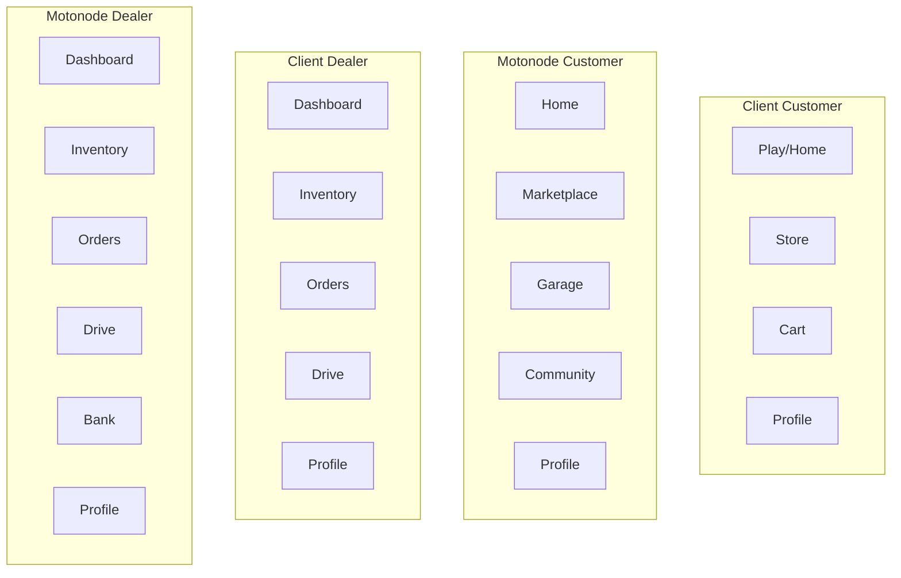

# Motonode vs Client — Comparison Document

**Motonode v1.0.0** · Legacy Client app v1.17.0  
**Last updated:** July 2026

---

## Branding and Tagline

| Element | Value |
|---------|-------|
| **App name** | Motonode |
| **Primary tagline** | *India's Largest Auto Marketplace* |
| **Onboarding pillars** | Book services near you · AI powered automotive help · Join the community |
| **Signup line** | *Sign up to join India's largest automotive community* |
| **AI companion** | *Your Automotive Companion* (Moto AI) |
| **Welcome push** | *Welcome to motonode, {name}!* — *Explore vehicles, services, and connect with dealers near you.* |
| **Brand color** | `#E60012` |
| **Deep link domain** | `motonode://` · `https://motonode.in` |
| **Store listing headline** | *Motonode: The Ultimate Automotive Hub for Buyers & Dealers* |

---

## Executive Summary

Motonode is a **navigation and UX rewrite**, not a reskin of the legacy Client app. The same backend powers both apps, but Motonode reorganizes the product around three pillars that did not exist as first-class experiences in Client:

1. **Garage** — a dedicated customer tab for vehicles, documents, bookings, and orders
2. **Community** — a dedicated social tab instead of folding posts into Home/Play
3. **Dealer Bank** — a dedicated dealer tab for payout management

Beyond navigation, Motonode adds richer **business registration** (cover photo, GST verification, working hours, social links), **unified push notifications** with login greetings, **dealer promo carousels**, **order item thumbnails**, and a **reusable invoice viewer** with share and download. Several mature Client features (i18n, vehicle compare, tyre slots, analytics) are not yet ported — see [Features Not Yet in Motonode](#features-not-yet-in-motonode).

| | Client (`client/`) | Motonode (`Motonode/`) |
|---|-------------------|------------------------|
| **Folder** | `client/` | `Motonode/` |
| **Screen layout** | `src/features/` (21 domains) | `src/screens/` (customer / dealer / shared) |
| **Version** | v1.17.0 | v1.0.0 |
| **State** | Zustand + MMKV | React Context |

---

## Navigation Comparison

### Customer bottom tabs

| Client | Motonode |
|--------|----------|
| Home (Play feed) | Home |
| Store (categories) | Marketplace |
| Cart | *(Cart is a stack screen, not a tab)* |
| Profile | **Garage** *(new)* |
| — | **Community** *(new)* |
| — | Profile |

### Dealer bottom tabs

| Client | Motonode |
|--------|----------|
| Dashboard | Dashboard |
| Inventory | Inventory |
| Orders | Orders |
| Drive (conditional) | Drive (conditional) |
| Profile | **Bank** *(new)* |
| — | Profile |

---

## New Screens in Motonode

Screens that are **new or substantially restructured** compared to the Client app.

| Screen | Path | What's new |
|--------|------|------------|
| **Garage hub** | `src/screens/customer/garage/GarageScreen.tsx` | Dedicated bottom tab with segmented **Vehicles / Bookings / Orders** |
| **Add vehicle** | `src/screens/customer/garage/AddVehicleScreen.tsx` | Multi-step stepper via `AddVehicleStepper.tsx` |
| **Garage vehicle detail** | `src/screens/customer/garage/GarageVehicleDetailScreen.tsx` | Hero image, primary vehicle flag, document viewer, service booking CTA |
| **Community tab** | `src/screens/customer/community/CommunityScreen.tsx` | Dedicated social tab with posts and stories |
| **Create community post** | `src/screens/customer/community/CreateCommunityPostScreen.tsx` | Standalone post creation |
| **Dealer Bank** | `src/screens/dealer/bank/DealerBankScreen.tsx` | First-class payout tab: bank account + UPI management |
| **Onboarding** | `src/screens/auth/OnboardingScreen.tsx` | 4-slide first-run flow (Client uses Splash) |
| **AI assistant** | `src/screens/customer/ai/AiScreen.tsx` | Standalone Moto AI screen |
| **Business details** | `src/screens/dealer/profile/BusinessDetailsScreen.tsx` | Read-only view of submitted registration data |
| **Service booking chain** | `src/screens/customer/marketplace/booking/*` | 8-step guided flow (date/time → vehicle → location → add-ons → summary → payment → confirmed → tracking) |
| **Booking detail** | `src/screens/customer/bookings/BookingDetailScreen.tsx` | Customer service booking detail with invoice share/download |

### Full service booking flow (Motonode only)

| Step | Screen |
|------|--------|
| 1 | `ServiceBookingMainScreen.tsx` |
| 2 | `ServiceBookingDateTimeScreen.tsx` |
| 3 | `ServiceBookingVehicleScreen.tsx` |
| 4 | `ServiceBookingLocationScreen.tsx` |
| 5 | `ServiceBookingAddonsScreen.tsx` |
| 6 | `ServiceBookingSummaryScreen.tsx` |
| 7 | `ServiceBookingPaymentScreen.tsx` |
| 8 | `ServiceBookingConfirmedScreen.tsx` / `ServiceBookingTrackingScreen.tsx` |

---

## Garage — Deep Dive

### Client baseline

In the legacy Client app, user vehicles live under **Profile**:

- `client/src/features/vehicle/AddUserVehicleScreen.tsx`
- `client/src/features/vehicle/UserVehicleDetail.tsx`
- `client/src/features/profile/sections/VehicleGrid.tsx`

There is **no dedicated Garage tab**. After login, users without vehicles may be redirected to add a vehicle, but the garage is not a hub for bookings and orders.

### Motonode enhancements

| Capability | Implementation |
|------------|----------------|
| **Hub layout** | `GarageScreen.tsx` — segmented tabs for Vehicles, Bookings (`GarageBookingsPanel.tsx`), and Orders (`OrderCard.tsx`) |
| **Add vehicle** | `AddVehicleScreen.tsx` with `AddVehicleStepper.tsx` multi-step UI |
| **Vehicle detail** | `GarageVehicleDetailScreen.tsx` — hero image, specs, options menu, delete vehicle |
| **Document management** | `GarageDocumentsPanel.tsx` + `DocumentUploadCard.tsx` — RC Book, Insurance, PUC Certificate, Driving License with upload status |
| **Primary vehicle** | Set/unset primary vehicle on detail screen |
| **Document viewer** | Full-screen modal to view uploaded documents |
| **Service booking from garage** | `startBookingFromGarage()` in `ServiceBookingContext` pre-fills vehicle brand/model |
| **Compatible services** | Detail screen loads services filtered by vehicle brand/model |
| **Guest state** | Clear sign-in prompt when user is a guest |
| **Deep link** | `garage` tab; `GarageVehicleDetail` stack route |
| **Pull to refresh** | Refresh vehicles, bookings, and orders independently |

---

## Business Registration — Field Comparison

**Motonode:** `src/screens/dealer/registration/RegistrationScreen.tsx`  
**Client:** `client/src/features/profile/BusinessRegistrationScreen.tsx`

### Fields present in both

- Business name, type, address, phone
- GST number
- Payout (UPI and/or bank account)
- Shop photos
- Document uploads (GST certificate, PAN card)

### New or enhanced in Motonode

| Field / feature | Motonode | Client |
|-----------------|----------|--------|
| Cover photo / store banner | Yes — `coverPhoto` / `storeBanner` upload in registration | No dedicated cover photo field |
| GST inline verification | Yes — regex validation, verify button, verified badge | Basic GST text field |
| GST document upload | Dedicated card with upload progress | Part of general documents |
| PAN document upload | Dedicated card with upload progress | Part of general documents |
| Working hours (open/close) | Yes — `workingHoursOpen`, `workingHoursClose` | Not in registration form |
| Working days | Yes — multi-select weekdays (`workingDays`) | Not in registration form |
| Social links | Yes — `socialLinks` (website, Instagram, etc.) | Not in registration form |
| Inline payout setup | Bank + UPI in same multi-step registration flow | UPI/bank within single long form |
| Multi-step UX | Card-based steps with visual progress | Single long scrollable form |
| Draft persistence | Not yet implemented | Saves draft to MMKV (`business-registration:draft:v1`) |
| Registration status banner | `RegistrationStatusBanner.tsx` on dealer dashboard | Routing gate only |
| Onboarding gate | `useDealerOnboardingStatus.ts` blocks inventory APIs until approved | Similar logic in `postAuthRouting.ts` |
| Read-only details screen | `BusinessDetailsScreen.tsx` | `BusinessRegistrationDetailsScreen.tsx` |

### Registration flow (Motonode)

1. **Dealer type** — `DealerTypeScreen.tsx` (showroom, workshop, etc.)
2. **Business registration** — multi-step `RegistrationScreen.tsx`
3. **Approval gate** — pending dealers see dashboard but cannot add inventory
4. **Business details** — view submitted data after registration

---

## Dealer Bank and Payouts

### New in Motonode

| Item | Path / detail |
|------|---------------|
| **Bank tab** | `DealerBankScreen.tsx` — dedicated bottom tab |
| **Bank account editor** | Inline edit for holder name, bank name, account number, IFSC, branch, account type |
| **UPI management** | Add/view UPI accounts with avatar badges |
| **Verification badges** | Shows verified status from approved registration |
| **Payout mapper** | `dealerPayoutMapper.ts` maps `IBusinessRegistration.payout` + `BusinessProfile` to display models |
| **Dashboard promo** | "Fast Payouts" slide in `DealerBannerCarousel.tsx` deep-links to Bank tab |

### Client equivalent

- Payout fields exist inside `BusinessRegistrationScreen.tsx`
- Settings screens (`BankDetailsScreen`, `UPIAccountsScreen`) exist in Motonode under dealer settings but Client has **no dedicated Bank tab**

---

## Invoice Generation

Both apps use the same backend invoice endpoints:

- **Order invoice:** `{API}/invoices/order/{orderId}?token={token}`
- **Service invoice:** `{API}/invoices/service/{bookingId}?token={token}`

### Placement comparison

| Context | Client | Motonode |
|---------|--------|----------|
| Customer order invoice | `LiveTracking.tsx`, `DeliveryMap.tsx` | `OrderTrackingScreen.tsx` |
| Dealer order invoice | Embedded in order detail | `DealerOrderDetailScreen.tsx` — dedicated invoice card |
| Customer service invoice | — | `BookingDetailScreen.tsx` |
| Dealer service invoice | `ServiceBookingsCard.tsx` | Dealer booking detail screens |

### UX enhancements in Motonode

| Enhancement | Implementation |
|-------------|----------------|
| **Reusable viewer** | `InAppBrowserModal.tsx` — WebView with loading state |
| **Share** | Native share sheet with invoice URL |
| **Download** | Saves invoice HTML to device Downloads folder |
| **Invoice card UI** | Consistent card with Share + Download buttons across order/booking screens |
| **Skeleton loaders** | Invoice action placeholders in `SkeletonLoaders.tsx` while loading |

---

## Other UI and Functionality Enhancements

### Customer

| Feature | Motonode | Client equivalent |
|---------|----------|-------------------|
| Home banner carousel | `BannerCarousel.tsx` — AI promo, Mega Sale, dealer store banner | `AdCarousal.tsx` |
| AI banner block | `AIBanner.tsx` — "Your Automotive Companion" | MetAI in support/chat |
| Marketplace browse | `MarketplaceScreen.tsx` with `MarketplaceTabs.tsx` + `MarketplaceFilterSheet.tsx` | `ProductDashboard.tsx` + `ProductCategories.tsx` |
| Consistent headers | `ChromeHeader.tsx` | `CustomHeader.tsx` |
| Cart | Stack screen (accessible from header/home) | Bottom tab |

### Dealer

| Feature | Motonode | Client equivalent |
|---------|----------|-------------------|
| Promo carousel | `DealerBannerCarousel.tsx` — 5 slides with CTAs | `DiscountBannerCarousel.tsx` |
| Order thumbnails | `OrderItemThumbnail.tsx` + `useOrderItemImages.ts` | `EnhancedOrderItem.tsx` (no image hook) |
| Order lifecycle | `DealerOrderLifecycleStepper.tsx` | Status text in list |
| Registration banner | `RegistrationStatusBanner.tsx` | Routing-only gate |

### Push notifications (refactored)

| Item | Path |
|------|------|
| Root handler | `PushNotificationHandler.tsx` (replaces deleted `ChatNotificationHandler.tsx`) |
| Notification service | `pushNotificationService.ts` — channels, display, navigation routing |
| FCM messaging | `pushMessagingService.ts` — foreground/background, token refresh |
| Token registration | `fcmTokenService.ts` — Firestore + server sync |
| Login greeting | `greetingNotification.ts` + `processPendingLoginGreeting()` |
| Storage keys | `PENDING_LOGIN_GREETING`, `LAST_GREETING_SHOWN_AT` |
| Background handler | Registered in `index.js` |
| Deep-link routing | Orders, bookings, chat, greetings via `linking.ts` |

### Dealer banner carousel actions

| Slide | CTA destination |
|-------|-----------------|
| 10% Off First Order | Orders tab |
| Weekend Flash Sale | Inventory tab |
| Fast Payouts | Bank tab |
| Grow Service Bookings | Service bookings |
| Promote Test Drives | Drive tab |

---

## Features Not Yet in Motonode

Honest gap list — features present in Client v1.17.0 but not yet fully ported:

| Feature | Client path |
|---------|-------------|
| **i18n** (EN / HI / TE) | Full translation system |
| **Vehicle compare** | `features/category/CompareScreen.tsx` |
| **Tyre slot management** | `features/inventory/TyreSlotManagementScreen.tsx` |
| **Pre-booking management** | `features/dashboard/PreBookingManagementScreen.tsx` |
| **Dealer analytics** | `features/dashboard/AnalyticsScreen.tsx` *(Motonode has placeholder "View Analytics" buttons)* |
| **Coupon modal** | `components/coupon/CouponModal.tsx` |
| **Wallet** | `features/profile/WalletItem.tsx` |
| **Delivery partner login** | `features/auth/DeliveryLogin.tsx` |
| **Phone OTP signup** | Disabled in both apps |
| **Business registration draft** | Client saves to MMKV; Motonode does not yet |
| **Tyre service request** | `features/service/TyreServiceRequestScreen.tsx` |
| **Privacy center / permissions** | `PrivacyCenterScreen.tsx`, `PrivacyPermissionsScreen.tsx` |
| **Wishlist** | `WishlistScreen.tsx` *(Motonode has wishlist context but screen TBD)* |

---

## Screen Mapping Appendix

Condensed mapping for QA regression: Client feature → Motonode equivalent.

| Client screen | Motonode equivalent | Status |
|---------------|----------------------|--------|
| `SplashScreen` | `OnboardingScreen` | Replaced |
| `CustomerLogin` | `LoginScreen` | Ported |
| `PhoneSignupScreen` | `SignupScreen` | Ported |
| `PlayScreen` (Home) | `HomeScreen` + `CommunityScreen` | Split |
| `ProductDashboard` / `ProductCategories` | `MarketplaceScreen` | Ported |
| `CartScreen` | `CartScreen` | Ported |
| `Profile` | `CustomerProfileScreen` | Ported |
| `AddUserVehicleScreen` | `AddVehicleScreen` | Enhanced |
| `UserVehicleDetail` | `GarageVehicleDetailScreen` | Enhanced |
| — | `GarageScreen` | **New** |
| `CreateNewPost` | `CreateCommunityPostScreen` | Ported |
| `StoryViewerScreen` | Community stories row | Partial |
| `ProductDetail` | `ProductDetailScreen` | Ported |
| `VehicleDetail` | `VehicleDetailScreen` | Ported |
| `ServiceDetail` | `ServiceDetailScreen` | Ported |
| `DealerStoreScreen` | `DealerStoreScreen` | Ported |
| `OrdersList` | `MyOrdersScreen` | Ported |
| `LiveTracking` | `OrderTrackingScreen` | Ported + invoice UX |
| `DeliveryMap` | `OrderTrackingScreen` | Merged |
| `CompareScreen` | — | Not ported |
| `DealerDashboard` | `DealerDashboardScreen` | Enhanced |
| `InventoryScreen` | `InventoryScreen` | Ported |
| `AddEditProductScreen` | `ProductFormScreen` | Ported |
| `AddEditVehicleScreen` | `VehicleFormScreen` | Ported |
| `AddEditServiceScreen` | `ServiceFormScreen` | Ported |
| `DealerOrdersList` | `DealerOrdersScreen` | Enhanced (thumbnails) |
| `QuickActionsScreen` (Drive) | `DriveScreen` | Ported |
| `BusinessRegistrationScreen` | `RegistrationScreen` | Enhanced |
| `BusinessRegistrationDetailsScreen` | `BusinessDetailsScreen` | Ported |
| `AnalyticsScreen` | Placeholder buttons | Not ported |
| `TyreSlotManagementScreen` | — | Not ported |
| `PreBookingManagementScreen` | — | Not ported |
| `TestDriveManagementScreen` | `DealerServiceBookingsScreen` | Partial |
| `ChatScreen` / `ChatMessageScreen` | `ChatListScreen` / `ChatScreen` | Ported |
| `MetAIChatScreen` | `AiScreen` / `AIChatScreen` | Ported |
| `NotificationScreen` | `NotificationsScreen` | Ported |
| `SavedAddresses` | `SavedAddressesScreen` | Ported |
| `WishlistScreen` | — | Not ported |
| — | `DealerBankScreen` | **New** |
| Service booking (tyre) | `marketplace/booking/*` | New multi-step flow |
| — | `BookingDetailScreen` | **New** (customer) |

---

## Deep Links Appendix

Configured in `src/navigation/linking.ts`.

**Prefixes:** `motonode://` · `https://motonode.in`

### Auth

| Route | Path |
|-------|------|
| Onboarding | `onboarding` |
| Login | `login` |
| Signup | `signup` |
| OTP verify | `otp-verify` |

### Customer tabs

| Route | Path |
|-------|------|
| Home | `home` |
| Marketplace | `marketplace` |
| Garage | `garage` |
| Community | `community` |
| Profile | `profile` |

### Customer stack (selected)

| Route | Path |
|-------|------|
| Cart | `cart` |
| Search | `search` |
| Notifications | `notifications` |
| Product detail | `product/:id` |
| Vehicle detail | `vehicle/:id` |
| AI assistant | `ai-assistant` |

### Dealer tabs

| Route | Path |
|-------|------|
| Dashboard | `dealer/dashboard` |
| Inventory | `dealer/inventory` |
| Orders | `dealer/orders` |
| Drive | `dealer/drive` |
| Bank | `dealer/bank` |
| Profile | `dealer/profile` |

### Dealer stack

| Route | Path |
|-------|------|
| Dealer type | `dealer/type` |
| Business registration | `dealer/register` |
| Business details | `dealer/business-details` |
| Product form | `dealer/product-form` |
| Vehicle form | `dealer/vehicle-form` |
| Service form | `dealer/service-form` |

---

## Key Source Files Reference

### Motonode (new app)

| Area | Path |
|------|------|
| Screens | `Motonode/src/screens/` |
| Navigation | `Motonode/src/navigation/` |
| Routes | `Motonode/src/constants/routes.ts` |
| Deep links | `Motonode/src/navigation/linking.ts` |
| Push | `Motonode/src/services/pushNotificationService.ts`, `pushMessagingService.ts` |
| Payout mapper | `Motonode/src/utils/dealerPayoutMapper.ts` |
| Architecture | `Motonode/ARCHITECTURE.md` |

### Client (baseline)

| Area | Path |
|------|------|
| Features | `client/src/features/` |
| Navigation | `client/src/navigation/Navigation.tsx` |
| Feature spec | `client/MOTONODE_FEATURES.md` |
| App store copy | `client/APP_STORE_LISTING.md` |

---

*This document is intended for stakeholders, QA, and release notes. For implementation details, refer to the linked source files.*
