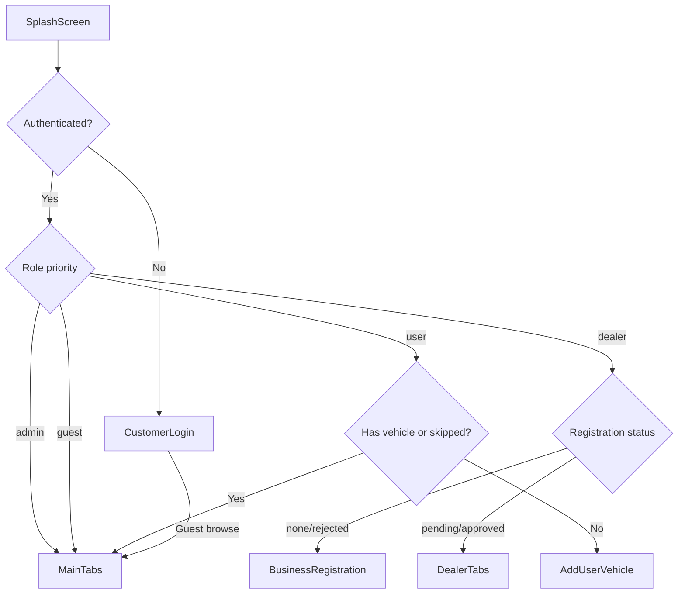
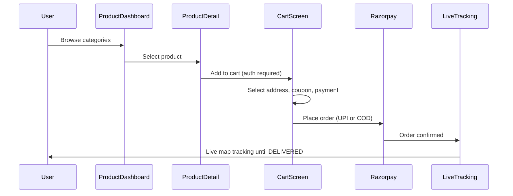
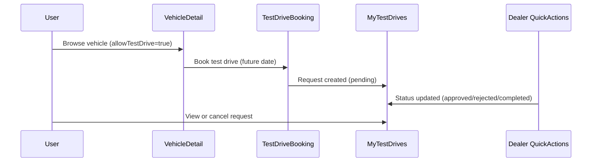
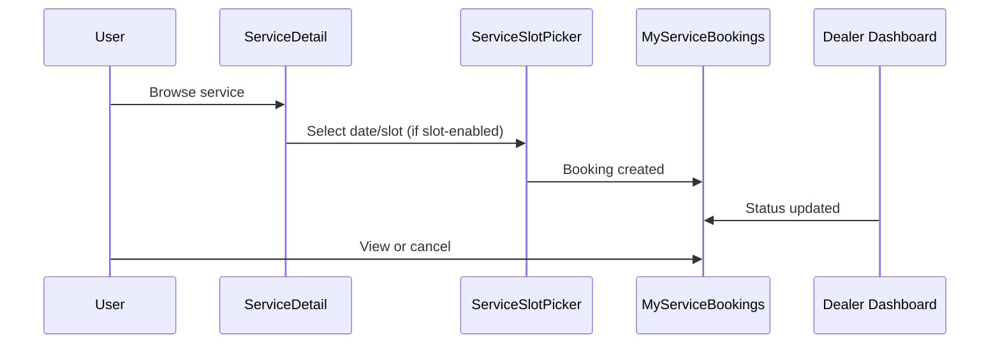
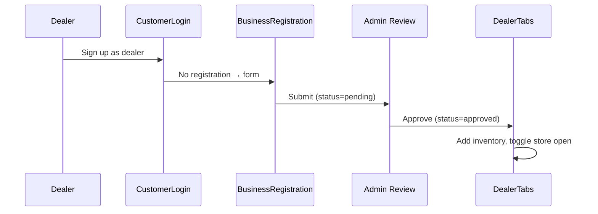

# Motonode Features List — End-to-End Requirements Document

**Version:** Client v1.17.0  
**Last updated:** June 2026  
**Scope:** React Native mobile app (`Car-Systems/client`) — features, roles, conditions, and user journeys as implemented in code.

---

## Table of Contents

1. [Overview](#1-overview)
2. [User Roles & Access Matrix](#2-user-roles--access-matrix)
3. [Global Conditions & Business Rules](#3-global-conditions--business-rules)
4. [Dealer Business Types & Capability Matrix](#4-dealer-business-types--capability-matrix)
5. [Customer / End-User Features](#5-customer--end-user-features)
6. [Dealer Features](#6-dealer-features)
7. [Shared / Cross-Role Features](#7-shared--cross-role-features)
8. [End-to-End User Journeys](#8-end-to-end-user-journeys)
9. [API Reference Summary](#9-api-reference-summary)
10. [Known Gaps & Partial Features](#10-known-gaps--partial-features)
11. [Appendix](#11-appendix)

---

## 1. Overview

### 1.1 Purpose

Motonode is an automotive super-app that brings **buyers**, **dealers**, and the **automotive community** together in one place. Users can browse and purchase products, explore dealer vehicles, book test drives and services, track deliveries, and connect via social feed and chat. Dealers manage inventory, orders, bookings, and customer enquiries from a dedicated dashboard.

### 1.2 Platform & Stack

| Layer | Technology |
|-------|------------|
| Framework | React Native 0.82, React 19, TypeScript |
| Navigation | React Navigation (native stack + bottom tabs) |
| State | Zustand + MMKV persistence |
| Networking | Axios, Socket.IO |
| Payments | Razorpay (UPI), Cash on Delivery |
| Push | Firebase Cloud Messaging, Notifee |
| Maps | react-native-maps, Geolocation |
| i18n | English, Hindi, Telugu |

### 1.3 App Structure

| Path | Purpose |
|------|---------|
| `src/navigation/` | Navigation tree, deep links |
| `src/features/` | Feature screens (21 domains) |
| `src/service/` | API layer |
| `src/state/` | Zustand stores (auth, cart, theme, etc.) |
| `src/config/` | OTP, Razorpay, service categories, dealer types |
| `src/auth/` | Post-login routing logic |

### 1.4 Store Taxonomy

The marketplace is organized into **13 store home tiles** (products, vehicles, services) plus a **Spare Parts** utility category. See server doc `server/docs/STORE_CATEGORIES.md` for the canonical taxonomy.

---

## 2. User Roles & Access Matrix

### 2.1 Roles

| Role | Identifier | Default Destination | Status |
|------|-----------|---------------------|--------|
| **Guest** | `user.isGuest === true`, `role: ['guest']` | MainTabs (browse-only) | Live |
| **User (customer)** | `role` includes `'user'` | MainTabs (after vehicle onboarding) | Live |
| **Dealer** | `role` includes `'dealer'` | DealerTabs (after business registration) | Live |
| **Admin** | `role` includes `'admin'` | MainTabs (same UI as customer) | Live |
| **Delivery partner** | `deliveryPartner` object in auth store | DeliveryDashboard | Partial — login exists, route not registered |

`role` may be a **string or array** (e.g. dual `user` + `dealer`).

### 2.2 Role Resolution Priority

When multiple roles exist, resolution order is:

```
admin → dealer → user
```

If a user has both `user` and `dealer` roles, **dealer onboarding path wins**.

**Source:** `src/navigation/Navigation.tsx`, `src/auth/postLoginNavigation.ts`

### 2.3 Navigation Flow



### 2.4 Customer Tabs (MainTabs)

| Tab | Screen | File |
|-----|--------|------|
| Home | Social feed + stories | `src/features/play/PlayScreen.tsx` |
| Store | Product dashboard + categories | `src/features/dashboard/ProductDashboard.tsx` |
| Cart | Checkout | `src/features/cart/CartScreen.tsx` |
| Profile | User profile | `src/features/profile/InstagramProfile.tsx` |

### 2.5 Dealer Tabs (DealerTabs)

| Tab | Screen | Condition |
|-----|--------|-----------|
| Home | DealerDashboard | Always |
| Inventory | InventoryScreen | Always |
| Orders | DealerOrdersList | Always |
| Drive | QuickActionsScreen | Only for Automobile Showroom or Bike Dealer |
| Profile | Profile | Always |

On mount, DealerTabs calls `GET /dealer/me/onboarding` and redirects to `BusinessRegistration` if registration is missing or rejected.

### 2.6 Dealer Onboarding States

Server SSOT: `GET /dealer/me/onboarding` — `src/auth/postAuthRouting.ts`

| Registration Status | Navigation Target | What Is Unlocked |
|--------------------|-------------------|------------------|
| None / rejected / null | BusinessRegistration | Registration form only |
| Pending | DealerTabs | View dashboard, lists; **cannot** add inventory or toggle store |
| Approved | DealerTabs | Full dealer capabilities |

---

## 3. Global Conditions & Business Rules

### 3.1 Authentication & Policy

| Rule | Detail |
|------|--------|
| Policy version | Terms and privacy version `2026-05` required at signup |
| Re-prompt | `requiresPolicyAcceptance` triggers policy alert → SignupPolicies screen |
| Auth guard | `withAuth()` / `useAuthGuard()` blocks guest/unauthenticated users on protected actions |
| Phone OTP | **Disabled** — `PHONE_OTP_AUTH_ENABLED = false` in `src/config/otpAuthConfig.ts` |
| Session | JWT in MMKV; refresh via `POST /refresh-token`; logout clears tokens, FCM, cart |

### 3.2 Protected Actions (Auth Required)

| Action | Guest | Logged-in User |
|--------|-------|----------------|
| Browse store / feed | Yes (limited on 401) | Yes |
| Add to cart / checkout | No | Yes |
| Test drive / pre-book | No | Yes |
| Service booking | No | Yes |
| Create post / story | No | Yes |
| Chat | No | Yes |
| Saved addresses API | Returns empty | Yes |

**Source:** `src/utils/AuthGuard.tsx`

### 3.3 Order Constraints

| Rule | Detail |
|------|--------|
| One active order | Customer cannot place a new order while an active order exists |
| Finished statuses | `DELIVERED`, `CANCELLED_BY_USER`, `CANCELLED_BY_DEALER`, `PAYMENT_FAILED`, `COD_NOT_COLLECTED`, `REFUND_COMPLETED`, or any status containing `CANCEL` |
| Active statuses | `ORDER_PLACED`, `PENDING_COD`, `PENDING_PAYMENT`, `PAYMENT_CONFIRMED`, `ORDER_CONFIRMED`, `PACKED`, `SHIPPED`, `OUT_FOR_DELIVERY`, `RETURN_REQUESTED`, `RETURN_PICKED`, `REFUND_INITIATED` |

**Source:** `src/utils/activeOrderUtils.ts`

### 3.4 Dealer & Store Rules

| Rule | Detail |
|------|--------|
| Add inventory | Requires business registration status `approved` |
| Store open toggle | Requires `approved`; disabled when `pending` |
| Customer purchases | Blocked when dealer `storeOpen === false` |
| Chat with dealer | Dealer must be `approved` |
| Dual role | Dealer onboarding path takes priority over customer path |

### 3.5 Checkout Fees

| Charge | Amount (INR) |
|--------|--------------|
| Delivery | ₹29 |
| Handling | ₹2 |
| COD surcharge | ₹5 (when Cash on Delivery selected) |

**Source:** `src/features/cart/CartScreen.tsx`

### 3.6 Payment Methods

| Method | Condition |
|--------|-----------|
| UPI (Razorpay) | Dealer registration `approved` AND payout configured (`payout.upiId` or `payout.bank`) |
| Cash on Delivery | Always available; forced when UPI preconditions not met |

---

## 4. Dealer Business Types & Capability Matrix

Seven business types drive inventory tabs, dashboard cards, service types, and navigation.

### 4.1 Capability Matrix

| Business Type | Inventory Tabs | Drive Tab | Dashboard Cards |
|--------------|----------------|-----------|-----------------|
| Automobile Showroom | products, vehicles, services | Yes | Customer enquiries, test drives, pre-bookings, inventory |
| Bike Dealer | products, vehicles, services | Yes | Same as showroom |
| Vehicle Wash Station | services only | No | Wash bookings, station open toggle |
| Mechanic Workshop | services only | No | Service bookings, workshop tasks |
| Detailing Center | services only | No | Service bookings |
| Spare Parts Dealer | products only | No | Orders, products |
| Riding Gear Store | products, services | No | Products, services |

**Source:** `src/features/inventory/InventoryScreen.tsx`, `src/features/dashboard/DealerDashboard.tsx`

### 4.2 Allowed Service Types by Business Type

| Business Type | Allowed Service Types |
|--------------|----------------------|
| Vehicle Wash Station | `car_wash` |
| Detailing Center | `car_detailing` |
| Bike Dealer | `bike_automobile`, `tire_service`, `battery_service` |
| Automobile Showroom | `car_automobile`, `tire_service`, `battery_service` |
| Mechanic Workshop / Riding Gear Store | All types |
| Default (unknown) | All types |

**Source:** `src/config/dealerServiceTypeConfig.ts`

### 4.3 Approval Gates Summary

```
Role = dealer
  └─ No registration / rejected → BusinessRegistration
  └─ pending / approved → DealerTabs
       └─ Add inventory (FAB) → requires approved
       └─ Store open toggle → requires approved
       └─ Dashboard APIs → may fail gracefully if pending
       └─ QuickActions (test drives/pre-bookings) → skips fetch if pending

Customer-facing
  └─ Chat with dealer → dealer must be approved
  └─ Buy from store → storeOpen must be true
  └─ View dealer store → any authenticated/guest user
```

---

## 5. Customer / End-User Features

Each feature includes: description, who can access, conditions, screens, and key APIs.

### 5.1 Auth & Onboarding

| Field | Detail |
|-------|--------|
| **Description** | Email/password login and signup; password reset; optional guest browse; dealer signup via account type selection |
| **Who** | All unauthenticated users |
| **Status** | Live (phone OTP disabled) |
| **Screens** | `CustomerLogin`, `OtpVerify`, `PhoneSignup`, `ForgotPassword`, `SignupPolicies` |
| **Conditions** | Signup requires `termsAccepted` + `privacyAccepted` (v2026-05); guest sets `isGuest: true` client-side; signup step 1 chooses `userType: 'user' \| 'dealer'` |
| **APIs** | `POST /auth/login`, `/auth/signup`, `/auth/forgot-password`, `/auth/reset-password`, `/auth/policy-acceptance`, `POST /refresh-token` |

### 5.2 Vehicle Onboarding

| Field | Detail |
|-------|--------|
| **Description** | First-time users prompted to add a personal vehicle to their profile |
| **Who** | Users with role `user` on first login |
| **Status** | Live |
| **Screens** | `AddUserVehicleScreen` |
| **Conditions** | Shown when user has no vehicles and has not skipped (`hasSkippedVehicle` flag); skippable |
| **APIs** | `POST /vehicles`, `GET /vehicles` |

### 5.3 Store Home & Categories

| Field | Detail |
|-------|--------|
| **Description** | Store dashboard with category tiles for products, vehicles, and services |
| **Who** | Guest, user, admin |
| **Status** | Live |
| **Screens** | `ProductDashboard`, `ProductCategories` |
| **Conditions** | Category tiles shown only when inventory count > 0; deep link `motonode://category/:categoryName` |
| **APIs** | `GET /dropdowns` |

### 5.4 Search, Filter, Sort & Compare

| Field | Detail |
|-------|--------|
| **Description** | Full catalog browse with text/voice search, filters, sort, grid/list view, product compare |
| **Who** | Guest, user, admin |
| **Status** | Live |
| **Screens** | `ProductCategories`, `CompareScreen`, `FilterModal`, `SortModal` |
| **Conditions** | Max **3 items** in compare; API cache TTL 5 minutes; guest 401 stops repeat API calls; filters include type, brand, price, sort; quick filters: New Arrivals, Best Deals, Top Rated; spare parts filter by vehicle type (Car/Bike) + brand; `allowTestDriveOnly` route param filters vehicles with `allowTestDrive === true` |
| **APIs** | `GET /user/products`, `/user/dealer-vehicles`, `/services`, `/dropdowns` |

### 5.5 Product Detail & Add to Cart

| Field | Detail |
|-------|--------|
| **Description** | Product page with images, dealer info, ratings display, share, wishlist, add to cart |
| **Who** | Guest (view), user (purchase) |
| **Status** | Live |
| **Screens** | `ProductDetail`, `RelatedProducts` |
| **Conditions** | Login required for add-to-cart; blocked if dealer `storeOpen === false`; stock limits enforced; ratings are **display-only** (fallback values if missing); deep link `motonode://product/:productId` |
| **APIs** | `GET /user/products/:id`, `GET /dealers/:dealerId` |

### 5.6 Checkout & Payment

| Field | Detail |
|-------|--------|
| **Description** | Cart checkout with address, coupons, delivery instructions, UPI or COD payment |
| **Who** | Authenticated users only |
| **Status** | Live |
| **Screens** | `CartScreen`, `PaymentStatusScreen` |
| **Conditions** | Non-empty cart; selected address; payment method; accepted terms; no active order; cart grouped by dealer; idempotency key on order creation; coupon validation: active, date range, `minOrderAmount`, `maxDiscountAmount` cap |
| **APIs** | `POST /user/orders`, `POST /user/orders/:id/verify-payment`, `POST /user/orders/:id/payment-action`, `GET /user/cart/applicable-coupons` |

### 5.7 Orders & Live Tracking

| Field | Detail |
|-------|--------|
| **Description** | Order history, bill details, post-checkout success, real-time delivery tracking on map |
| **Who** | Authenticated users |
| **Status** | Live |
| **Screens** | `OrdersList`, `ProductOrder`, `OrderSuccess`, `LiveTracking`, `LiveMap`, `OrderWorkflow` |
| **Conditions** | Invoice URL: `{BASE_URL}/invoices/order/{orderId}?token={accessToken}`; opened from orders list, notifications, or live-status banner |
| **APIs** | `GET /user/orders`, `GET /user/orders/:id`, `GET /user/orders/:id/status`; Socket.IO for live updates |

### 5.8 Saved Addresses

| Field | Detail |
|-------|--------|
| **Description** | CRUD saved delivery addresses with map picker |
| **Who** | Authenticated users |
| **Status** | Live |
| **Screens** | `SavedAddresses`, `AddNewAddress`, `AddressForm`, `AddressMapView` |
| **Conditions** | Returns empty array without access token |
| **APIs** | `GET/POST /addresses`, `PATCH/DELETE /addresses/:id` |

### 5.9 Wishlist / Favourites

| Field | Detail |
|-------|--------|
| **Description** | Save products, vehicles, and services locally |
| **Who** | All users (local storage) |
| **Status** | Live |
| **Screens** | `WishlistScreen` |
| **Conditions** | IDs stored in MMKV via `favoritesStore`; no server sync; screen fetches full catalogs and filters by saved IDs |
| **APIs** | Uses catalog APIs (products, vehicles, services) |

### 5.10 Vehicle Browse & Booking

| Field | Detail |
|-------|--------|
| **Description** | Browse dealer vehicles; book test drives and pre-book vehicles; chat with dealer |
| **Who** | Guest (view), user (book) |
| **Status** | Live |
| **Screens** | `VehicleDetail`, `TestDriveBookingScreen`, `PreBookingScreen`, `TestDriveBookingModal`, `PreBookingModal` |
| **Conditions** | Test drive: `vehicle.allowTestDrive === true`, login required, date must be **future** (not today); pre-book: `availability === 'available'`, login required, future date; chat requires dealer `approved` |
| **APIs** | `GET /user/dealer-vehicles`, `POST /user/test-drives`, `POST /user/pre-bookings`, `GET /user/dealer/:dealerId/info` |

### 5.11 Test Drive Management (Customer)

| Field | Detail |
|-------|--------|
| **Description** | View and cancel own test drive requests |
| **Who** | Authenticated users |
| **Status** | Live |
| **Screens** | `MyTestDrivesScreen` |
| **Conditions** | Status filters: all, pending, approved, rejected, completed, cancelled |
| **APIs** | `GET /user/test-drives`, `GET /user/test-drives/:id`, `PATCH /user/test-drives/:id/cancel` |

### 5.12 Service Browse & Booking

| Field | Detail |
|-------|--------|
| **Description** | Service detail, slot-based booking (tyre services), direct date/time booking |
| **Who** | Authenticated users |
| **Status** | Live |
| **Screens** | `ServiceDetail`, `TyreServiceRequestScreen`, `ServiceSlotPicker`, `MyServiceBookingsScreen` |
| **Conditions** | Slot booking when `service.slotBookingEnabled` OR `serviceType === 'tire_service'`; tyre service requires registration number; date picker: next 7 days (today through +6); direct book requires preferred time |
| **APIs** | `GET /services`, `GET /services/:id`, `GET /services/dealer/:dealerId`, service slots, `POST /user/service-bookings`, `GET /user/service-bookings`, `PATCH .../cancel` |

### 5.13 User Vehicle Garage

| Field | Detail |
|-------|--------|
| **Description** | Add and manage personal vehicles on profile |
| **Who** | Authenticated users |
| **Status** | Live |
| **Screens** | `AddUserVehicleScreen`, `UserVehicleDetail`, `VehicleGrid` (profile) |
| **Conditions** | Guests see dummy vehicle data; 404 on list returns empty array |
| **APIs** | `POST/GET/PUT/DELETE /vehicles`, `/vehicles/:id` |

### 5.14 Dealer Storefront (Customer View)

| Field | Detail |
|-------|--------|
| **Description** | Public per-dealer store with products, vehicles, services tabs, search, share |
| **Who** | Guest, user, admin |
| **Status** | Live |
| **Screens** | `DealerStoreScreen` |
| **Conditions** | OPEN/CLOSED badge; purchases blocked when closed; deep link `motonode://store/:dealerId` |
| **APIs** | `GET /dealers/:dealerId`, `GET /user/products?dealerId=`, `/user/dealer-vehicles`, `/services/dealer/:dealerId` |

### 5.15 Profile & Settings

| Field | Detail |
|-------|--------|
| **Description** | Instagram-style profile (posts, vehicles, stats), settings hub, account management |
| **Who** | Authenticated users (non-dealer menu items) |
| **Status** | Live |
| **Screens** | `InstagramProfile`, `ProfileSettings`, `EditProfile`, `PaymentMethodsInfoScreen`, `PrivacyCenterScreen`, `PrivacyPermissionsScreen`, `TermsAndConditionsScreen` |
| **Customer menu items** | Edit profile, saved addresses, payment methods info, my orders, test drives, service bookings, vehicle alert, MetAI support, terms, privacy center, delete account |
| **Conditions** | "Reviews" menu routes to OrdersList (not a review-writing feature) |
| **APIs** | `GET/PUT /profile`, `GET /profile/stats`, `GET/PUT /profile/privacy-settings`, `DELETE /profile/account` |

### 5.16 Social Feed (Play / Home Tab)

| Field | Detail |
|-------|--------|
| **Description** | Community feed, stories, create posts/status, likes and comments |
| **Who** | Guest (view), user (post) |
| **Status** | Live |
| **Screens** | `PlayScreen`, `CreateNewPost`, `StoryViewerScreen`, `StatusComposeScreen`, `PlayStoryRail` |
| **Conditions** | Create post requires auth; block/report users available |
| **APIs** | `GET/POST/PUT/DELETE /posts`, like/unlike, comment, `GET /stories/feed`, `POST /stories`, `POST /stories/:id/view`, block/report |

### 5.17 Chat & Groups

| Field | Detail |
|-------|--------|
| **Description** | Direct messages, group chats, join requests, live location sharing, image messages |
| **Who** | Authenticated users |
| **Status** | Live |
| **Screens** | `ChatScreen`, `ChatMessageScreen`, `CreateGroupScreen`, `GroupDetailScreen`, `EditGroupScreen`, `JoinRequestsScreen`, `LocationPickerScreen`, `UserSelectionScreen` |
| **Conditions** | Open dealer chat utility resolves dealer userId from business registration |
| **APIs** | `/chats`, `/chats/direct`, `/chats/group`, messages, live-location; `/groups`, `/groups/:id/join`, members |

### 5.18 Notifications

| Field | Detail |
|-------|--------|
| **Description** | In-app notification list, push notifications with deep links |
| **Who** | Authenticated users |
| **Status** | Live |
| **Screens** | `NotificationScreen` |
| **Conditions** | FCM token registered on login; deep links to orders, test drives, service bookings |
| **APIs** | `GET /user/notifications`, `PUT .../read`, `PUT /read-all`, `GET /unread-count`, `POST/DELETE /user/fcm-token` |

### 5.19 MetAI Support Chat

| Field | Detail |
|-------|--------|
| **Description** | In-app AI/support chat with quick actions and history |
| **Who** | Authenticated users |
| **Status** | Live |
| **Screens** | `MetAIChatScreen` |
| **APIs** | `POST /support/chat`, `GET /support/quick-actions`, `POST /support/quick-action`, `GET/DELETE /support/history` |

### 5.20 Vehicle Alert

| Field | Detail |
|-------|--------|
| **Description** | Lookup vehicle by registration plate and notify owner (blocking, wrong parking, emergency, other) |
| **Who** | Authenticated users |
| **Status** | Live |
| **Screens** | `VehicleAlertScreen` |
| **Conditions** | Plate must exist in system; reason required; optional custom message for "other" |
| **APIs** | `GET /user/vehicle-alerts/reasons`, `POST /user/vehicle-alerts/lookup`, `POST /user/vehicle-alerts`, `PATCH .../resolve` |

### 5.21 Coupons

| Field | Detail |
|-------|--------|
| **Description** | Apply coupons at checkout from applicable list |
| **Who** | Authenticated users |
| **Status** | Live |
| **Screens** | `CouponModal` (in cart) |
| **Conditions** | Active coupon, within date range, meets `minOrderAmount`, discount capped by `maxDiscountAmount` |
| **APIs** | `GET /user/coupons`, `GET /user/cart/applicable-coupons?totalAmount=` |

### 5.22 Language & Theme

| Field | Detail |
|-------|--------|
| **Description** | App language and light/dark theme selection |
| **Who** | All users |
| **Status** | Live |
| **Screens** | `LanguageSection` (in ProfileSettings) |
| **Conditions** | Languages: English (`en`), Hindi (`hi`), Telugu (`te`) |
| **APIs** | Client-side only (Zustand stores) |

### 5.23 Not Implemented (Customer)

| Feature | Status | Notes |
|---------|--------|-------|
| User-submitted product/vehicle reviews | Not implemented | Ratings displayed with hardcoded fallbacks in ProductDetail |
| Customer enquiry submission | Not implemented | Dealer-side enquiry management only |
| Wallet / stored cards | Not implemented | PaymentMethodsInfoScreen is informational only |

---

## 6. Dealer Features

### 6.1 Dealer Signup

| Field | Detail |
|-------|--------|
| **Description** | Create account with dealer role during registration |
| **Who** | Unauthenticated users choosing dealer account type |
| **Status** | Live |
| **Screens** | `CustomerLogin` (signup step 1: `userType: 'dealer'`) |
| **Conditions** | Same auth flow as customer; `role: 'dealer'` sent to backend |
| **APIs** | `POST /auth/signup` |

### 6.2 Business Registration

| Field | Detail |
|-------|--------|
| **Description** | Full dealer onboarding: business details, payout, shop photos, documents, location |
| **Who** | Dealers without approved registration |
| **Status** | Live |
| **Screens** | `BusinessRegistrationScreen`, `BusinessRegistrationDetailsScreen` |
| **Business types** | Automobile Showroom, Bike Dealer, Vehicle Wash Station, Mechanic Workshop, Detailing Center, Spare Parts Dealer, Riding Gear Store |
| **Validation** | Required: business name, type, address, phone, GST (15-char format), payout (UPI ID or bank account/IFSC/account name); optional: shop photos (max 2, max 5MB each), documents (GST/LICENSE/ID/PAN); edit locked when `approved`; submit → status `pending` |
| **APIs** | `POST /dealer/business-registration`, `PUT /dealer/business-registration/:id`, `GET /dealer/business-registration/user/:userId` |

### 6.3 Dealer Dashboard

| Field | Detail |
|-------|--------|
| **Description** | Business-type-aware home with stats, revenue, inventory preview, enquiries, bookings |
| **Who** | Dealers with registration (pending or approved) |
| **Status** | Live |
| **Screens** | `DealerDashboard`, dashboard cards (see Section 4.1) |
| **Conditions** | Redirects to BusinessRegistration if no registration or `rejected`; pending dealers view dashboard but APIs may fail gracefully; wrapped with live order banner |
| **APIs** | `GET /dealer/orders/stats`, `/dealer/orders`, `/dealer/products`, `/dealer/vehicles`, `/dealer/bookings`, `/dealer/customer-enquiries`, `/dealer/service-bookings` |

### 6.4 Analytics

| Field | Detail |
|-------|--------|
| **Description** | Charts for products, vehicles, services, and orders |
| **Who** | Dealers |
| **Status** | Live |
| **Screens** | `AnalyticsScreen` |
| **APIs** | `GET /dealer/products`, `/dealer/vehicles`, `/dealer/services`, `/dealer/orders` |

### 6.5 Inventory CRUD

| Field | Detail |
|-------|--------|
| **Description** | Tabbed inventory management for products, vehicles, and services |
| **Who** | Dealers |
| **Status** | Live |
| **Screens** | `InventoryScreen`, `AddEditProductScreen`, `AddEditVehicleScreen`, `AddEditServiceScreen` |
| **Conditions** | Tab visibility by business type (Section 4.1); add item (FAB) requires `approved`; banner shown for no registration, pending, or rejected; service types restricted by `getAllowedDealerServiceTypes()` |
| **APIs** | `GET/POST/PUT/DELETE /dealer/products`, `/dealer/vehicles`, `/dealer/services` |

### 6.6 Tyre Slot Management

| Field | Detail |
|-------|--------|
| **Description** | Manage bookable time slots for tyre/slot-enabled services |
| **Who** | Dealers with slot-enabled services |
| **Status** | Live |
| **Screens** | `TyreSlotManagementScreen` |
| **Conditions** | Navigated from AddEditServiceScreen for slot-enabled services |
| **APIs** | `GET/POST/PATCH/DELETE /dealer/services/:serviceId/slots` |

### 6.7 Order Management

| Field | Detail |
|-------|--------|
| **Description** | View, accept, and update order status; live delivery map |
| **Who** | Dealers |
| **Status** | Live |
| **Screens** | `DealerOrdersList`, `DeliveryMap` |
| **Conditions** | Tabs: delivered / available / in progress; in-progress = `ORDER_CONFIRMED` or `OUT_FOR_DELIVERY`; live order banner on Home/Dashboard/Orders/Inventory |
| **APIs** | `GET /dealer/orders`, `GET /dealer/orders/:id`, `POST /dealer/orders/:id/accept`, `PATCH /dealer/orders/:id/status` |

### 6.8 Test Drives & Pre-Bookings

| Field | Detail |
|-------|--------|
| **Description** | Manage incoming test drive and pre-booking requests |
| **Who** | Automobile Showroom and Bike Dealer only |
| **Status** | Live |
| **Screens** | `QuickActionsScreen`, `TestDriveManagementScreen`, `PreBookingManagementScreen` |
| **Conditions** | Drive tab only for vehicle dealers; pending registration skips API fetch, shows empty state |
| **APIs** | `GET/PATCH /dealer/test-drives`, `GET/PATCH /dealer/pre-bookings` |

### 6.9 Service Bookings

| Field | Detail |
|-------|--------|
| **Description** | Manage service bookings with status updates, rejection reasons, invoice download |
| **Who** | Workshop, wash, detailing dealers |
| **Status** | Live |
| **Screens** | `ServiceBookingsCard`, `WorkshopTasksCard`, `VehicleWashBookingsCard` |
| **APIs** | `GET/PATCH /dealer/service-bookings`; invoice: `GET /invoices/service/:bookingId?token=` |

### 6.10 Customer Enquiries

| Field | Detail |
|-------|--------|
| **Description** | View and update customer vehicle enquiries |
| **Who** | Automobile Showroom and Bike Dealer |
| **Status** | Live |
| **Screens** | `CustomerEnquiriesCard` |
| **Conditions** | Status values: `new`, `responded`, `resolved` |
| **APIs** | `GET /dealer/customer-enquiries`, `PATCH /dealer/customer-enquiries/:enquiryId/status` |

### 6.11 Store Toggle & Sharing

| Field | Detail |
|-------|--------|
| **Description** | Toggle store/workshop open status; share store URL |
| **Who** | Approved dealers |
| **Status** | Live |
| **Screens** | `AccountSettingsSection`, `StationOpenToggle` |
| **Conditions** | Toggle enabled only when `approved`; share URL: `{webBase}/store/{dealerId}` and deep link `motonode://store/:dealerId` |
| **APIs** | `PATCH /dealer/business-registration/:id/store-status` |

### 6.12 Dealer Profile

| Field | Detail |
|-------|--------|
| **Description** | Profile with business info tab instead of posts |
| **Who** | Dealers |
| **Status** | Live |
| **Screens** | `InstagramProfile` (businessInfo tab), `ProfileSettings` |
| **Conditions** | Dealers default to businessInfo tab; cannot manage posts; profile settings back nav returns to DealerTabs; wallet section hides "Your orders" for dealers; activity section hides customer test drives/bookings/alerts |
| **APIs** | `GET /dealer/business-registration/user/:userId`, `PATCH .../booking-settings` (`maxDailyBookings` 1–999 or null) |

---

## 7. Shared / Cross-Role Features

### 7.1 Deep Links

| Pattern | Target Screen |
|---------|---------------|
| `motonode://product/:productId` | ProductDetail |
| `motonode://category/:categoryName` | ProductCategories |
| `motonode://store/:dealerId` | DealerStore |

### 7.2 Remote Config

Server-driven visual effects and store banners fetched via `appConfigService` and stored in `appConfigStore`:

- Seasonal visual effects (rain, snow, overlays)
- Store banner carousel content
- Rain notice on home/dealer dashboard

### 7.3 Privacy & Legal

| Feature | Screen | Available To |
|---------|--------|--------------|
| Privacy center | PrivacyCenterScreen | All |
| Privacy permissions | PrivacyPermissionsScreen | All |
| Terms & conditions | TermsAndConditionsScreen | All |
| Account deletion | ProfileSettings | Authenticated users |
| Payment methods info | PaymentMethodsInfoScreen | All |

### 7.4 Real-Time (Socket.IO)

Used for:

- Order status updates and live tracking
- Push notification delivery
- Chat messages and live location
- Notification room subscriptions

**Source:** `src/service/socketService.tsx`

---

## 8. End-to-End User Journeys

### 8.1 Buyer Purchase Flow



**Steps:**
1. Browse store home or category list
2. Open product detail → verify store is open
3. Add to cart (login required)
4. Cart tab → select delivery address, apply coupon, choose UPI or COD, accept terms
5. Place order (blocked if active order exists)
6. UPI: Razorpay checkout → payment verification → OrderSuccess
7. COD: Order placed with PENDING_COD status
8. Track delivery via LiveTracking (map + workflow steps)
9. Order completes at DELIVERED status

### 8.2 Test Drive Flow



**Steps:**
1. Browse vehicles (filter: test-drive eligible)
2. Open vehicle detail → tap Test Drive
3. Select future date, submit (login required)
4. View status in Profile → My Test Drives
5. Dealer approves/rejects/completes via Drive tab
6. User can cancel while pending

### 8.3 Service Booking Flow



**Steps:**
1. Browse services by category or dealer store
2. Open service detail
3. For slot-enabled/tyre services: pick date (7-day window) and time slot
4. For direct booking: pick preferred date and time
5. Tyre services: provide vehicle registration number
6. View in Profile → My Service Bookings
7. Dealer updates status from dashboard cards

### 8.4 Dealer Onboarding Flow



**Steps:**
1. Sign up with account type "Dealer"
2. Complete business registration form (GST, payout, documents, photos)
3. Submit → status becomes `pending` → routed to DealerTabs (limited access)
4. Admin approves → status `approved`
5. Dealer can add inventory, toggle store open, receive orders
6. If rejected → forced back to BusinessRegistration for edits

---

## 9. API Reference Summary

Grouped by domain. All paths are relative to the API base URL. Full server documentation: `server/docs/`.

### 9.1 Authentication

| Method | Endpoint | Purpose |
|--------|----------|---------|
| POST | `/auth/login` | Email/password login |
| POST | `/auth/signup` | Register (role: user or dealer) |
| POST | `/auth/forgot-password` | Request password reset |
| POST | `/auth/reset-password` | Reset password |
| POST | `/auth/send-otp` | Send phone OTP (disabled in client) |
| POST | `/auth/verify-otp` | Verify phone OTP |
| POST | `/auth/complete-phone-signup` | Complete phone signup |
| POST | `/auth/policy-acceptance` | Accept terms/privacy |
| POST | `/refresh-token` | Refresh JWT |

### 9.2 Profile

| Method | Endpoint | Purpose |
|--------|----------|---------|
| GET/PUT | `/profile` | Get/update profile |
| GET | `/profile/stats` | Profile statistics |
| GET/PUT | `/profile/privacy-settings` | Privacy settings |
| DELETE | `/profile/account` | Delete account |

### 9.3 Customer Catalog & Orders

| Method | Endpoint | Purpose |
|--------|----------|---------|
| GET | `/user/products` | List products |
| GET | `/user/products/:id` | Product detail |
| GET | `/user/dealer-vehicles` | List dealer vehicles |
| GET | `/services` | List services |
| GET | `/services/:id` | Service detail |
| GET | `/services/dealer/:dealerId` | Services by dealer |
| POST | `/user/orders` | Create order |
| GET | `/user/orders` | List orders |
| GET | `/user/orders/:id` | Order detail |
| GET | `/user/orders/:id/status` | Order status |
| POST | `/user/orders/:id/verify-payment` | Verify UPI payment |
| POST | `/user/orders/:id/payment-action` | Get payment action |
| GET | `/user/coupons` | List coupons |
| GET | `/user/cart/applicable-coupons` | Applicable coupons for cart total |

### 9.4 Customer Bookings

| Method | Endpoint | Purpose |
|--------|----------|---------|
| POST/GET | `/user/test-drives` | Create/list test drives |
| PATCH | `/user/test-drives/:id/cancel` | Cancel test drive |
| POST/GET | `/user/pre-bookings` | Create/list pre-bookings |
| PATCH | `/user/pre-bookings/:id/cancel` | Cancel pre-booking |
| POST/GET | `/user/service-bookings` | Create/list service bookings |
| PATCH | `/user/service-bookings/:id/cancel` | Cancel service booking |
| POST/GET | `/vehicles` | User vehicle garage CRUD |
| GET/POST | `/user/vehicle-alerts/*` | Vehicle alert lookup and create |

### 9.5 Dealer Operations

| Method | Endpoint | Purpose |
|--------|----------|---------|
| GET | `/dealer/me/onboarding` | Onboarding snapshot (SSOT) |
| POST/PUT | `/dealer/business-registration` | Register/update business |
| GET | `/dealer/business-registration/user/:userId` | Registration by user |
| PATCH | `/dealer/business-registration/:id/store-status` | Store open/closed |
| PATCH | `/dealer/business-registration/:id/booking-settings` | Max daily bookings |
| GET/POST/PATCH | `/dealer/orders` | Dealer order management |
| GET/POST/PUT/DELETE | `/dealer/products` | Product CRUD |
| GET/POST/PUT/DELETE | `/dealer/vehicles` | Vehicle CRUD |
| GET/POST/PUT/DELETE | `/dealer/services` | Service CRUD |
| GET/POST/PATCH/DELETE | `/dealer/services/:id/slots` | Service slot management |
| GET/PATCH | `/dealer/test-drives` | Test drive management |
| GET/PATCH | `/dealer/pre-bookings` | Pre-booking management |
| GET/PATCH | `/dealer/service-bookings` | Service booking management |
| GET/PATCH | `/dealer/customer-enquiries` | Customer enquiries |
| GET | `/dealer/orders/stats` | Order statistics |
| GET | `/dealers/:dealerId` | Public dealer info |
| GET | `/user/dealer/:dealerId/info` | Dealer info for chat |

### 9.6 Social, Chat & Support

| Method | Endpoint | Purpose |
|--------|----------|---------|
| GET/POST/PUT/DELETE | `/posts` | Social posts CRUD |
| POST | `/posts/:id/like`, `/unlike`, `/comment` | Post interactions |
| GET/POST/DELETE | `/stories/*` | Stories feed and CRUD |
| GET/POST | `/chats/*` | Direct and group chat |
| GET/POST/PUT/DELETE | `/groups/*` | Group management |
| POST/GET/DELETE | `/support/*` | MetAI support chat |

### 9.7 Addresses & Notifications

| Method | Endpoint | Purpose |
|--------|----------|---------|
| GET/POST | `/addresses` | Address CRUD |
| PATCH/DELETE | `/addresses/:id` | Update/delete address |
| GET/PUT | `/user/notifications` | Notification list and read status |
| POST/DELETE | `/user/fcm-token` | Push token management |

---

## 10. Known Gaps & Partial Features

| Item | Status | Detail |
|------|--------|--------|
| Phone OTP auth | Disabled | `PHONE_OTP_AUTH_ENABLED = false`; MSG91 not production-ready |
| Delivery partner dashboard | Partial | `DeliveryLogin` exists; `DeliveryDashboard` route not registered in Navigation |
| DealerPendingApproval screen | Unused in routing | Pending dealers route to DealerTabs instead |
| Nearby car wash dealers API | Unused | `GET /dealers/nearby/car-wash` defined but not called from UI |
| DealershipRequestSection | Unused | Component defined but not imported anywhere |
| Commission logic | Not in client | No commission calculation or display in mobile app |
| Product/vehicle reviews | Not implemented | Display-only ratings with fallback values |
| Customer enquiry submission | Not implemented | Dealer-side enquiry management only |
| Admin UI | Not in client | Admin role uses customer UI; admin panel is separate web app |

---

## 11. Appendix

### 11.1 Full Navigation Screen List

**Auth & onboarding:** SplashScreen, CustomerLogin, DeliveryLogin, ForgotPassword, OtpVerify, PhoneSignup, SignupPolicies, DealerPendingApproval, AddUserVehicle

**Customer tabs:** PlayScreen (Home), ProductDashboard (Store), CartScreen, InstagramProfile (Profile)

**Dealer tabs:** DealerDashboard, InventoryScreen, DealerOrdersList, QuickActionsScreen (Drive), Profile

**Catalog & commerce:** ProductDetail, VehicleDetail, UserVehicleDetail, ServiceDetail, ProductCategories, CompareScreen, DealerStoreScreen

**Orders & delivery:** OrdersList, ProductOrder, OrderSuccess, LiveTracking, DeliveryMap, PaymentStatus

**Dealer management:** AddEditProduct, AddEditVehicle, AddEditService, TyreSlotManagement, TestDriveManagement, PreBookingManagement, Analytics, BusinessRegistration, BusinessRegistrationDetails

**Bookings:** TestDriveBooking, PreBooking, TyreServiceRequest, MyTestDrives, MyServiceBookings

**Profile & settings:** ProfileSettings, EditProfile, WishlistScreen, SavedAddresses, AddNewAddress, AddressForm, PaymentMethodsInfo, PrivacyCenter, PrivacyPermissions, TermsAndConditions, VehicleAlert

**Social & chat:** CreateNewPost, StoryViewer, StatusCompose, Chat, ChatMessage, UserSelection, CreateGroup, GroupDetail, EditGroup, JoinRequests, LocationPicker, NotificationScreen, MetAIChat

### 11.2 Business Registration Validation Rules

| Field | Rule |
|-------|------|
| Business name | Required |
| Business type | Required (one of 7 types) |
| Address | Required |
| Phone | Required |
| GST number | Required, 15-character format |
| Payout | UPI ID **or** bank account + IFSC + account name required |
| Shop photos | Optional, max 2 files, max 5MB each |
| Documents | Optional (GST, LICENSE, ID, PAN) |
| Edit mode | Fields locked when status is `approved` |
| On submit | Status set to `pending` |

### 11.3 Order Status Lifecycle

**Finished (customer may place new order):**

`DELIVERED`, `CANCELLED_BY_USER`, `CANCELLED_BY_DEALER`, `PAYMENT_FAILED`, `COD_NOT_COLLECTED`, `REFUND_COMPLETED`, any status containing `CANCEL`

**Active (blocks new order):**

`ORDER_PLACED`, `PENDING_COD`, `PENDING_PAYMENT`, `PAYMENT_CONFIRMED`, `ORDER_CONFIRMED`, `PACKED`, `SHIPPED`, `OUT_FOR_DELIVERY`, `RETURN_REQUESTED`, `RETURN_PICKED`, `REFUND_INITIATED`

**Display mapping (simplified):**

| Status | User Message |
|--------|-------------|
| ORDER_PLACED / available | Packing your order |
| ORDER_CONFIRMED / confirmed | Arriving Soon |
| PACKED | Order Packed |
| SHIPPED | Order Shipped |
| OUT_FOR_DELIVERY / arriving | Order Picked Up |
| DELIVERED | Order Delivered |

### 11.4 Payment Fee Breakdown

| Line Item | Amount |
|-----------|--------|
| Item total | Sum of cart items |
| Coupon discount | Per coupon rules |
| Delivery charge | ₹29 |
| Handling charge | ₹2 |
| COD surcharge | ₹5 (if COD selected) |
| **Grand total** | Items − coupon + delivery + handling + COD |

### 11.5 Feature → Source File Index

| Feature Domain | Primary Files |
|---------------|---------------|
| Navigation | `src/navigation/Navigation.tsx` |
| Auth routing | `src/auth/postLoginNavigation.ts`, `src/auth/postAuthRouting.ts` |
| Auth guard | `src/utils/AuthGuard.tsx` |
| Auth service | `src/service/authService.tsx` |
| Cart & checkout | `src/features/cart/CartScreen.tsx`, `src/state/cartStore.tsx` |
| Orders | `src/features/order/`, `src/service/orderService.tsx` |
| Dealer ops | `src/service/dealerService.tsx`, `src/features/dashboard/`, `src/features/inventory/` |
| Vehicles | `src/features/vehicle/`, `src/service/vehicleService.tsx` |
| Services | `src/features/service/`, `src/service/serviceService.tsx` |
| Social | `src/features/play/`, `src/service/postService.tsx` |
| Chat | `src/features/chat/`, `src/service/chatService.tsx` |
| Profile | `src/features/profile/`, `src/service/profileService.tsx` |
| Payments | `src/services/payment/`, `src/config/razorpayCheckout.ts` |
| Maps & tracking | `src/features/map/`, `src/features/delivery/` |
| Notifications | `src/features/notifications/`, `src/service/notificationService.ts` |
| Config | `src/config/dealerServiceTypeConfig.ts`, `src/config/otpAuthConfig.ts` |

---

*This document reflects the Motonode client as implemented in code. For backend API details, see `Car-Systems/server/docs/`. For admin-panel features, see `Car-Systems/admin-panel/`.*
