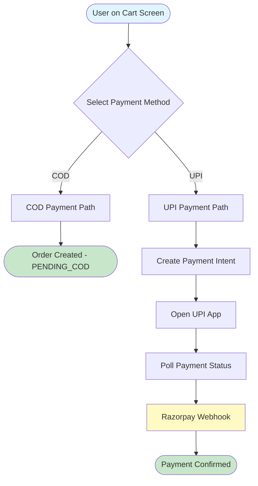
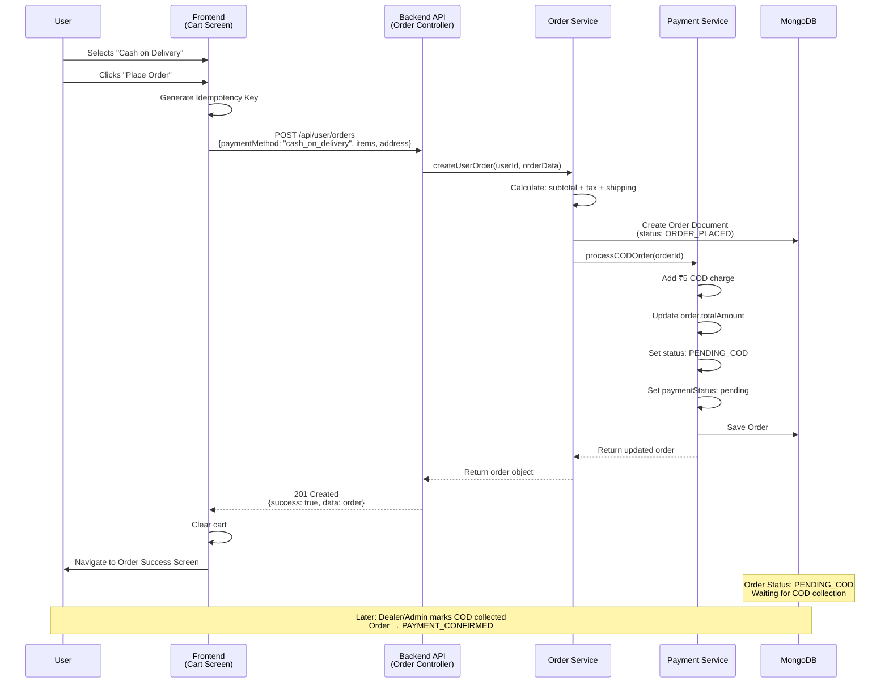
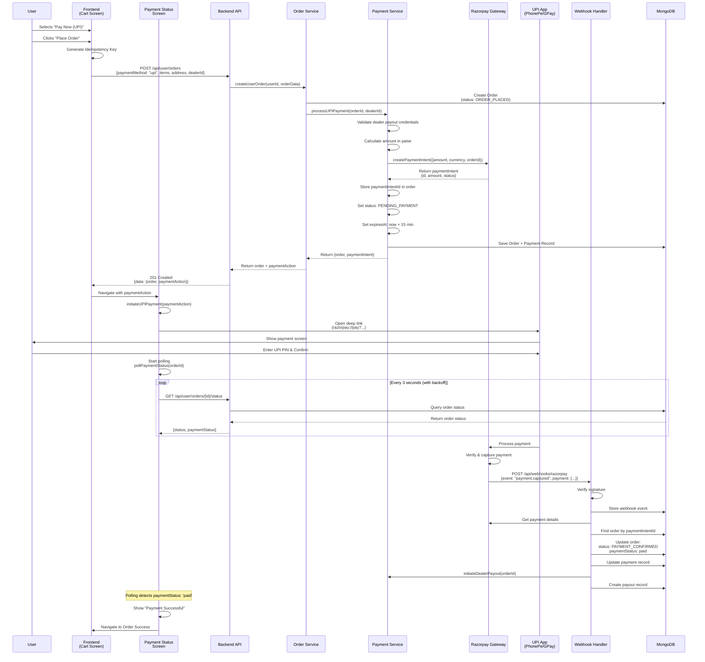
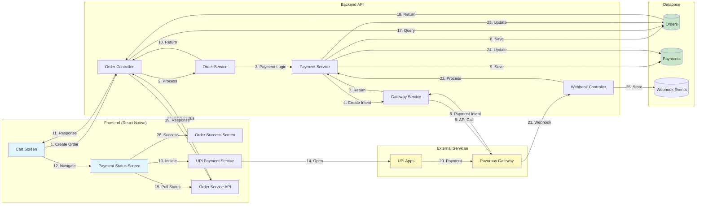
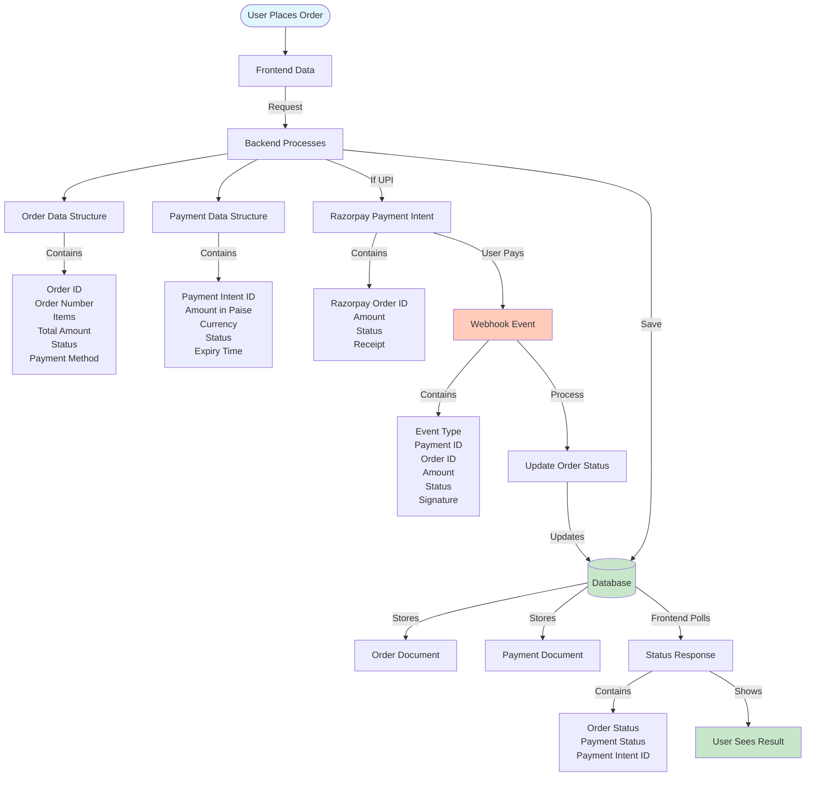
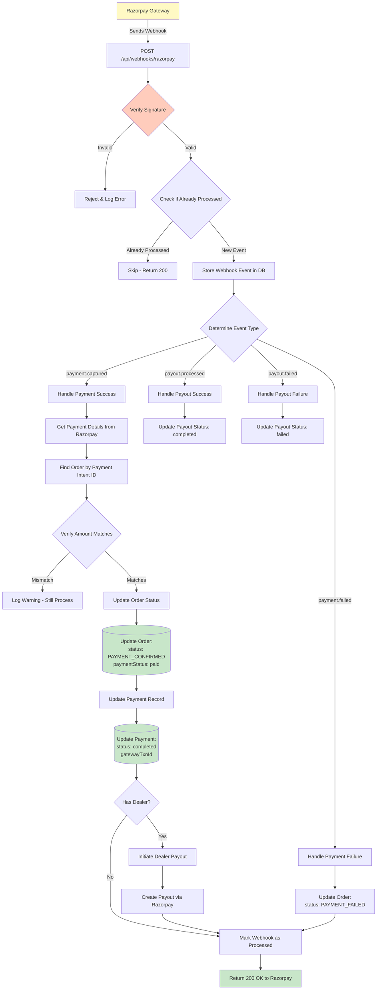
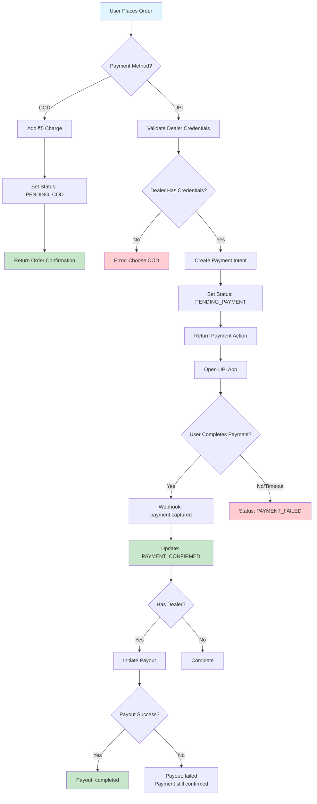
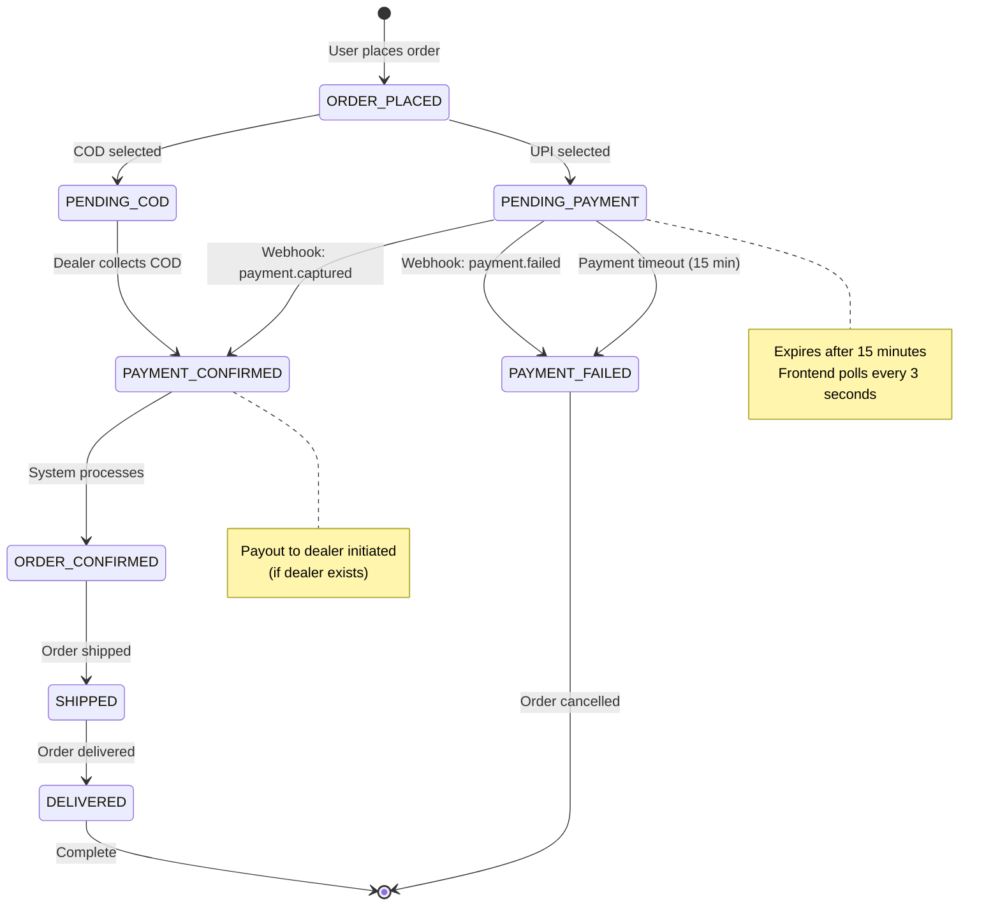
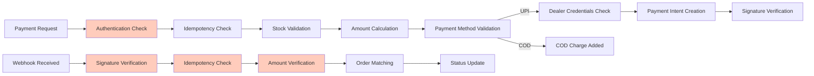

# Payment Flow - Visual Explanation

This document explains the complete payment flow from frontend to backend using visual diagrams.

---

## 📊 Table of Contents

1. [Overall Payment Flow](#overall-payment-flow)
2. [COD Payment Flow (Detailed)](#cod-payment-flow-detailed)
3. [UPI Payment Flow (Detailed)](#upi-payment-flow-detailed)
4. [Component Interaction Diagram](#component-interaction-diagram)
5. [Data Flow Diagram](#data-flow-diagram)
6. [Webhook Processing Flow](#webhook-processing-flow)
7. [Payment Status Polling Flow](#payment-status-polling-flow)

---

## 🎯 Overall Payment Flow



---

## 💵 COD Payment Flow (Detailed)



### COD Flow Steps:

1. **User Action**: Selects COD and places order
2. **Frontend**: Sends order request with idempotency key
3. **Backend**: Creates order, calculates total
4. **Payment Service**: Adds ₹5 COD charge, sets status to PENDING_COD
5. **Response**: Order confirmation returned
6. **Frontend**: Shows success screen
7. **Later**: Manual COD collection by dealer/admin

---

## 💳 UPI Payment Flow (Detailed)



### UPI Flow Steps:

1. **Order Creation**: User places order with UPI method
2. **Payment Intent**: Backend creates Razorpay payment intent
3. **UPI App**: Frontend opens UPI app via deep link
4. **User Payment**: User completes payment in UPI app
5. **Polling**: Frontend polls order status every 3 seconds
6. **Webhook**: Razorpay sends webhook when payment succeeds
7. **Status Update**: Backend updates order to PAYMENT_CONFIRMED
8. **Frontend Update**: Polling detects change, shows success
9. **Payout**: Backend initiates payout to dealer

---

## 🔄 Component Interaction Diagram



---

## 📥 Data Flow Diagram



---

## 🔔 Webhook Processing Flow



---

## 🔍 Payment Status Polling Flow

```mermaid
flowchart TD
    Start([Payment Status Screen Loads]) --> InitiatePayment[Initiate UPI Payment]
    
    InitiatePayment --> OpenUPIApp[Open UPI App via Deep Link]
    
    OpenUPIApp --> StartPolling[Start Polling Timer]
    
    StartPolling --> PollRequest[GET /api/user/orders/{id}/status]
    
    PollRequest --> BackendQuery[Backend Queries Database]
    
    BackendQuery --> CheckStatus{Check Payment Status}
    
    CheckStatus -->|paymentStatus: 'paid'| PaymentSuccess[Payment Successful!]
    CheckStatus -->|paymentStatus: 'failed'| PaymentFailed[Payment Failed]
    CheckStatus -->|paymentStatus: 'pending'| ContinuePolling[Continue Polling]
    
    ContinuePolling --> WaitInterval[Wait 3 seconds<br/>with exponential backoff]
    WaitInterval --> CheckTimeout{Timeout Reached?<br/>2 minutes max}
    
    CheckTimeout -->|No| PollRequest
    CheckTimeout -->|Yes| TimeoutError[Payment Timeout Error]
    
    PaymentSuccess --> UpdateUI[Update UI:<br/>Show Success Screen]
    UpdateUI --> NavigateSuccess[Navigate to Order Success]
    
    PaymentFailed --> UpdateUIFailed[Update UI:<br/>Show Failed Screen]
    UpdateUIFailed --> ShowOptions[Show Options:<br/>Retry or Choose COD]
    
    TimeoutError --> UpdateUITimeout[Update UI:<br/>Show Timeout Message]
    UpdateUITimeout --> ShowOptions
    
    style Start fill:#e1f5ff
    style PaymentSuccess fill:#c8e6c9
    style PaymentFailed fill:#ffcdd2
    style TimeoutError fill:#ffcdd2
    style NavigateSuccess fill:#c8e6c9
```

### Polling Mechanism Details:

- **Initial Interval**: 3 seconds
- **Exponential Backoff**: Increases by 1.5x each time (max 10 seconds)
- **Maximum Duration**: 2 minutes (120 seconds)
- **Stops When**: 
  - Payment status becomes `paid` → Success
  - Payment status becomes `failed` → Failure
  - Timeout reached → Error

---

## 🎯 Key Decision Points



---

## 📋 Status Transition Diagram



---

## 🔐 Security & Validation Points



---

## 📊 Summary Table

| Step | Component | Action | Result |
|------|-----------|--------|--------|
| 1 | Frontend | User selects payment method | Payment method chosen |
| 2 | Frontend | Sends order request | POST /api/user/orders |
| 3 | Backend | Creates order | Order document created |
| 4 | Backend | Processes payment method | COD: Add charge<br/>UPI: Create intent |
| 5 | Backend | Returns response | Order + paymentAction (if UPI) |
| 6 | Frontend | For UPI: Opens app | UPI app launched |
| 7 | Frontend | Starts polling | Status checked every 3s |
| 8 | User | Completes payment | Payment processed by Razorpay |
| 9 | Razorpay | Sends webhook | Webhook received |
| 10 | Backend | Processes webhook | Order status updated |
| 11 | Frontend | Polling detects change | UI updated |
| 12 | Backend | Initiates payout | Dealer payout created |

---

## 🎓 Key Concepts Explained

### 1. **Idempotency Key**
- Prevents duplicate orders if user clicks "Place Order" multiple times
- Generated on frontend, sent in request headers
- Backend checks if order with same key already exists

### 2. **Payment Intent**
- A Razorpay concept: reservation of payment amount
- Created before user pays
- Has expiry time (15 minutes)
- Links to order via paymentIntentId

### 3. **Deep Link**
- Special URL that opens UPI app directly
- Format: `razorpay://pay?amount=X&currency=INR&order_id=Y`
- Frontend uses React Native Linking to open it

### 4. **Webhook**
- Razorpay sends HTTP POST to your server when payment completes
- Contains payment details and signature
- Must verify signature to ensure it's from Razorpay
- Processed asynchronously (returns 200 immediately)

### 5. **Polling**
- Frontend checks order status repeatedly
- Needed because webhooks may be delayed
- Uses exponential backoff to reduce server load
- Stops when payment status changes

### 6. **Payout**
- Separate from customer payment
- Transfers money from your account to dealer's account
- Happens after payment is confirmed
- Can succeed or fail independently

---

## 🚀 Quick Reference

### COD Flow:
```
User → Frontend → Backend → Add ₹5 → Save Order → Return → Success Screen
```

### UPI Flow:
```
User → Frontend → Backend → Razorpay Intent → UPI App → User Pays → 
Razorpay → Webhook → Backend Updates → Frontend Polling Detects → Success Screen
```

---

## 📝 Notes

- All monetary amounts are stored in **paise** (₹1 = 100 paise) in Razorpay
- Frontend displays amounts in **rupees** (converts paise/100)
- Webhooks are processed asynchronously - always return 200 OK quickly
- Polling has a maximum duration of 2 minutes
- Payment intents expire after 15 minutes if not completed
- COD orders wait for manual collection by dealer/admin

---

**Last Updated**: Payment System Flow Documentation
**Version**: 1.0
