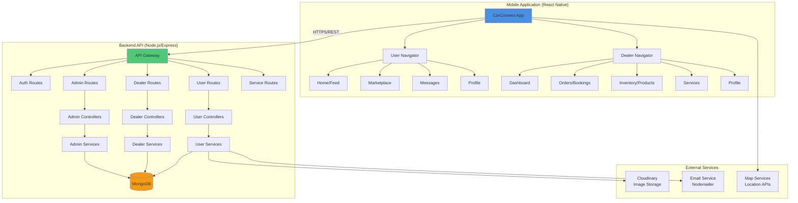
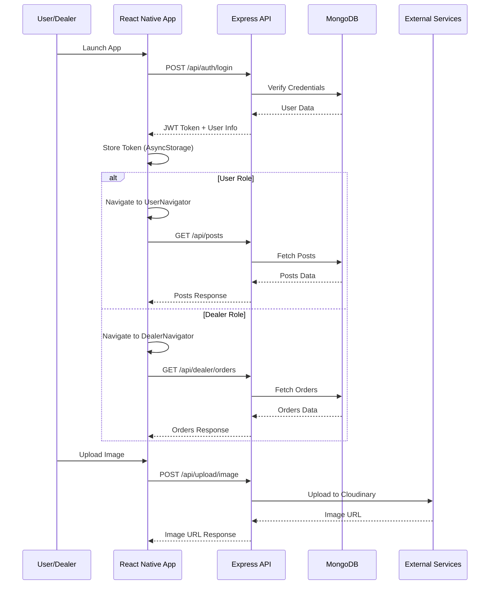
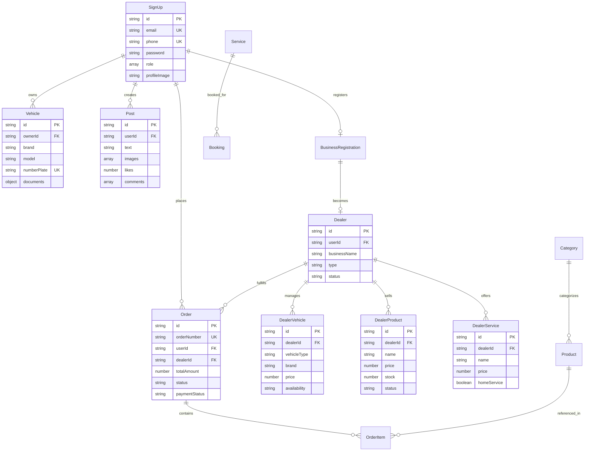
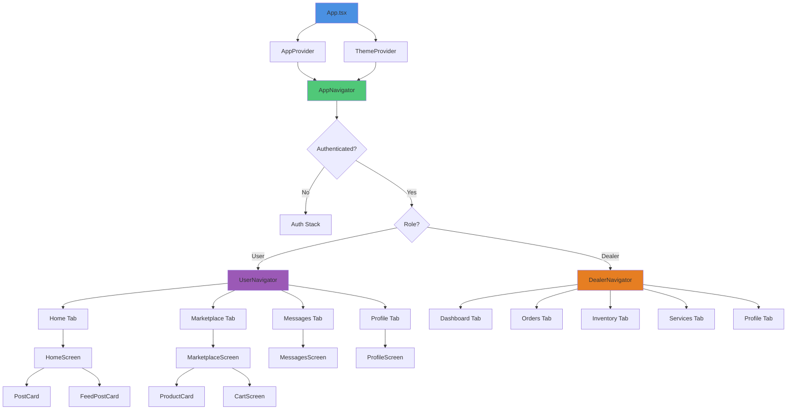
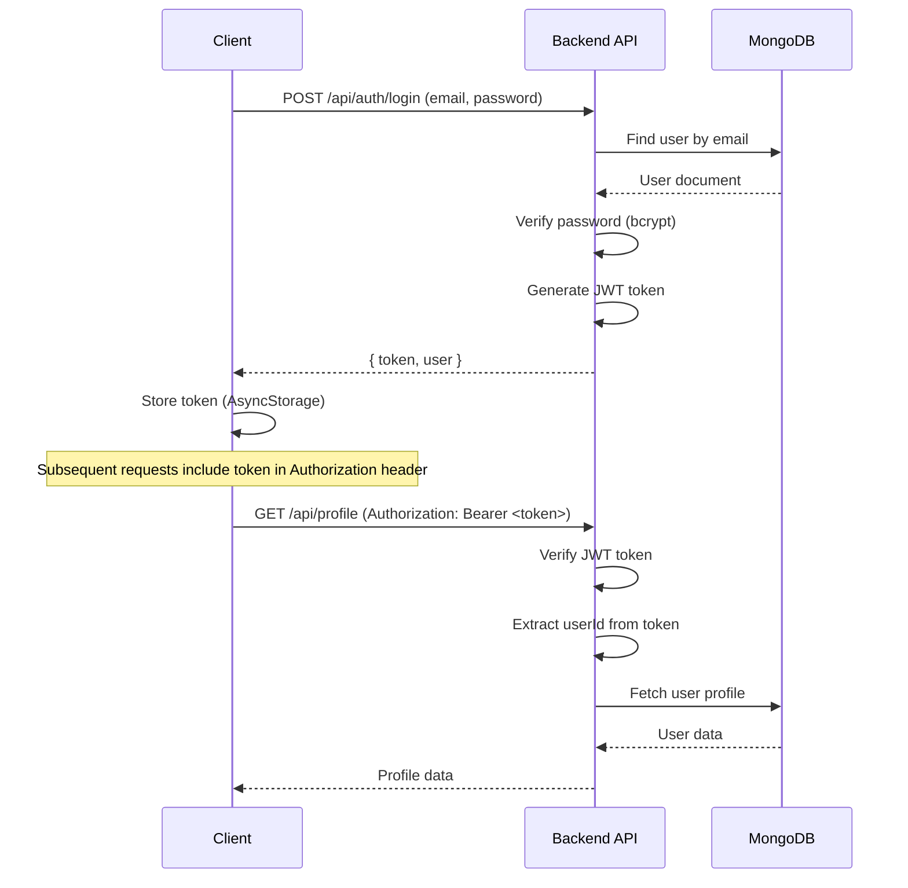

# Car Connect - Automotive Super App

A comprehensive full-stack automotive platform combining **CarConnect** (user mobile app) and **Dealer Central** (dealer business management) in a unified ecosystem. Built with React Native for mobile and Node.js/Express for backend services.

## 📱 Overview

Car Connect is a super app that connects vehicle owners with automotive service providers, dealers, and a community of car enthusiasts. The platform offers social networking, marketplace, service booking, document management, and emergency features.

### Key Highlights

- **Dual Platform**: Single codebase serving both end-users and business dealers
- **Social Network**: Connect with car enthusiasts, share posts, join groups
- **E-Commerce**: Complete marketplace with products, orders, and tracking
- **Service Booking**: Book car wash, detailing, test drives, and more
- **Document Management**: Secure vault for vehicle documents (RC, Insurance, Pollution, DL)
- **Emergency SOS**: Quick access to emergency contacts with GPS tracking
- **Dealer Management**: Complete business management system for 6 dealer types

---

## 🏗️ Technical Architecture

### System Architecture Diagram



### Application Flow Architecture



### Database Schema Architecture



### Component Architecture (Frontend)



---

## ✨ Features

### 👤 User Features (CarConnect)

#### Authentication & Profile
- **Multi-method Login**: Email/Password, OTP, Google Sign-In
- **Registration**: Multi-step registration with vehicle selection
- **Profile Management**: Edit profile, upload profile picture, manage settings
- **Password Management**: Forgot password, reset password with email verification

#### Social Network
- **Home Feed**: View posts from friends and community
- **Create Posts**: Text, image, and video posts with location tagging
- **Interactions**: Like, comment on posts
- **Friends System**: Add friends, view friend profiles
- **Groups**: Create and join groups, group messaging
- **Messaging**: Direct messages and group chats with location sharing

#### Vehicle Management
- **Vehicle Registration**: Register multiple vehicles (Cars/Bikes)
- **Document Vault**: Secure storage for:
  - RC (Registration Certificate)
  - Insurance documents
  - Pollution certificate
  - Driving License
- **Primary Driver**: Assign primary driver to vehicles
- **Document Access**: Share document access with trusted contacts

#### Marketplace
- **Product Browsing**: Browse products with filters (category, price, vehicle type)
- **Product Details**: View detailed product information, images, specifications
- **Wishlist**: Save favorite products
- **Shopping Cart**: Add products to cart, manage quantities
- **Checkout**: Secure checkout with multiple payment methods
- **Order Management**: View order history, track orders, view invoices
- **Order Tracking**: Real-time order status updates with timeline

#### Services
- **Car Wash Booking**: Book car wash services
- **Doorstep Wash**: Schedule home service car wash
- **Test Drive**: Request test drives from dealers
- **Service History**: View past service bookings

#### Emergency Features
- **SOS System**: Quick access emergency button
- **Emergency Contacts**: Pre-configured emergency contacts
- **GPS Tracking**: Share location with emergency contacts
- **Background Location**: Continuous location tracking during emergencies

### 🏢 Dealer Features (Dealer Central)

#### Business Management
- **Business Registration**: Register business with 6 dealer types:
  - Automobile Showroom
  - Vehicle Wash Station
  - Detailing Center
  - Mechanic Workshop
  - Spare Parts Dealer
  - Riding Gear Store
- **Approval System**: Admin approval workflow with approval codes
- **Business Profile**: Manage business information, operating hours, location

#### Inventory Management
- **Vehicle Inventory** (for Showrooms):
  - Add/Edit/Delete vehicles
  - Manage vehicle availability (available/sold/reserved)
  - Upload vehicle images
  - Set pricing and specifications
  - Filter and search vehicles
- **Product Inventory** (for Retail Dealers):
  - Add/Edit/Delete products
  - Manage stock levels
  - Update product status (active/inactive)
  - Upload product images
  - Set pricing and categories

#### Service Management
- **Service Catalog**: Create and manage services
- **Service Types**: Regular services and home services
- **Pricing**: Set service prices and duration
- **Availability**: Enable/disable services
- **Service Categories**: Organize services by category

#### Order Management
- **Order Dashboard**: View all orders with statistics
- **Order Details**: Detailed order information
- **Status Updates**: Update order status (pending → confirmed → processing → shipped → delivered)
- **Order Tracking**: Add tracking information
- **Order Cancellation**: Cancel orders with reason
- **Refunds**: Process order refunds
- **Order Analytics**: View order statistics and revenue

#### Analytics & Reports
- **Dashboard Analytics**: 
  - Total orders count
  - Revenue statistics
  - Order status distribution
  - Popular products/services
- **Order Statistics**: Filter by status, payment status, date range
- **Performance Metrics**: Track business performance over time

---

## 🛠️ Tech Stack

### Frontend (React Native)
- **Framework**: React Native 0.82.1 with TypeScript
- **Navigation**: React Navigation v6 (Stack Navigator, Bottom Tab Navigator)
- **State Management**: React Context API + Custom Hooks
- **HTTP Client**: Axios
- **Storage**: AsyncStorage
- **Maps**: react-native-maps
- **Icons**: react-native-vector-icons (Feather icons)
- **Internationalization**: i18next + react-i18next
- **Image Handling**: react-native-image-picker
- **Location**: @react-native-community/geolocation
- **UI Components**: Custom theme-aware components

### Backend (Node.js/Express)
- **Runtime**: Node.js >= 20
- **Framework**: Express.js
- **Language**: TypeScript
- **Database**: MongoDB with Mongoose ODM
- **Authentication**: JWT (JSON Web Tokens)
- **Password Hashing**: bcryptjs
- **File Upload**: Multer + Cloudinary
- **Email**: Nodemailer
- **Logging**: Winston
- **API Documentation**: Swagger/OpenAPI
- **Validation**: Custom validation middleware
- **Error Handling**: Centralized error handler

### Infrastructure & Services
- **Cloud Storage**: Cloudinary (for images)
- **Email Service**: Nodemailer (SMTP)
- **Database**: MongoDB Atlas or Local MongoDB
- **Deployment**: Vercel (serverless) or traditional hosting

---

## 📁 Project Structure

```
Car Connect/
├── backend/                          # Backend API Server
│   ├── src/
│   │   ├── config/                   # Configuration files
│   │   │   ├── database.ts           # MongoDB connection
│   │   │   ├── cloudinary.ts         # Cloudinary setup
│   │   │   ├── env.ts                # Environment variables
│   │   │   └── swagger.ts            # API documentation config
│   │   ├── controllers/              # Request handlers
│   │   │   ├── admin/                # Admin controllers
│   │   │   │   ├── categoryController.ts
│   │   │   │   ├── dashboardController.ts
│   │   │   │   ├── dealerController.ts
│   │   │   │   ├── orderController.ts
│   │   │   │   ├── productController.ts
│   │   │   │   ├── reportController.ts
│   │   │   │   ├── settingsController.ts
│   │   │   │   └── userController.ts
│   │   │   ├── dealer/               # Dealer controllers
│   │   │   │   ├── businessRegistrationController.ts
│   │   │   │   ├── orderController.ts
│   │   │   │   ├── productController.ts
│   │   │   │   ├── serviceController.ts
│   │   │   │   └── vehicleController.ts
│   │   │   ├── user/                 # User controllers
│   │   │   │   ├── postController.ts
│   │   │   │   ├── profileController.ts
│   │   │   │   └── vehicleController.ts
│   │   │   ├── authController.ts     # Authentication
│   │   │   ├── dealerController.ts   # Public dealer info
│   │   │   └── serviceController.ts  # Public services
│   │   ├── middleware/               # Express middleware
│   │   │   ├── adminMiddleware.ts    # Admin role verification
│   │   │   ├── authMiddleware.ts     # JWT authentication
│   │   │   ├── dealerMiddleware.ts   # Dealer role verification
│   │   │   ├── uploadMiddleware.ts   # File upload handling
│   │   │   └── validationMiddleware.ts # Request validation
│   │   ├── models/                   # Mongoose models
│   │   │   ├── user/                 # User-related models
│   │   │   │   ├── Post.ts           # Social posts
│   │   │   │   └── Vehicle.ts        # User vehicles
│   │   │   ├── BusinessRegistration.ts
│   │   │   ├── Category.ts
│   │   │   ├── Dealer.ts
│   │   │   ├── DealerVehicle.ts
│   │   │   ├── Order.ts
│   │   │   ├── Product.ts
│   │   │   ├── Service.ts
│   │   │   ├── Settings.ts
│   │   │   └── SignUp.ts             # User accounts
│   │   ├── routes/                   # API routes
│   │   │   ├── admin/                # Admin routes (/admin/*)
│   │   │   │   ├── categoryRoutes.ts
│   │   │   │   ├── dashboardRoutes.ts
│   │   │   │   ├── dealerRoutes.ts
│   │   │   │   ├── orderRoutes.ts
│   │   │   │   ├── productRoutes.ts
│   │   │   │   ├── reportRoutes.ts
│   │   │   │   ├── settingsRoutes.ts
│   │   │   │   ├── userRoutes.ts
│   │   │   │   └── index.ts
│   │   │   ├── dealer/               # Dealer routes (/api/dealer/*)
│   │   │   │   ├── businessRegistrationRoutes.ts
│   │   │   │   ├── orderRoutes.ts
│   │   │   │   ├── productRoutes.ts
│   │   │   │   ├── serviceRoutes.ts
│   │   │   │   ├── vehicleRoutes.ts
│   │   │   │   └── index.ts
│   │   │   ├── user/                 # User routes (/api/*)
│   │   │   │   ├── postRoutes.ts     # /api/posts
│   │   │   │   ├── profileRoutes.ts  # /api/profile
│   │   │   │   ├── uploadRoutes.ts   # /api/upload
│   │   │   │   ├── vehicleRoutes.ts  # /api/vehicles
│   │   │   │   └── index.ts
│   │   │   ├── authRoutes.ts         # /api/auth
│   │   │   ├── dealerRoutes.ts       # /api/dealers (public)
│   │   │   └── serviceRoutes.ts      # /api/services (public)
│   │   ├── services/                 # Business logic layer
│   │   │   ├── admin/                # Admin services
│   │   │   ├── dealer/               # Dealer services
│   │   │   ├── user/                 # User services
│   │   │   ├── authService.ts        # Authentication logic
│   │   │   └── serviceService.ts     # Public service logic
│   │   ├── types/                    # TypeScript interfaces
│   │   │   ├── dealer/               # Dealer-related types
│   │   │   ├── admin.ts
│   │   │   ├── auth.ts
│   │   │   ├── post.ts
│   │   │   ├── service.ts
│   │   │   └── vehicle.ts
│   │   ├── utils/                    # Utility functions
│   │   │   ├── emailService.ts       # Email sending
│   │   │   ├── errorHandler.ts       # Error handling
│   │   │   └── logger.ts             # Winston logger
│   │   └── index.ts                  # Server entry point
│   ├── docs/                         # API documentation
│   │   ├── ADMIN_API_ROUTES.md
│   │   ├── API_DOCUMENTATION.md
│   │   ├── LOGGER_SETUP.md
│   │   └── PROFILE_API.md
│   ├── logs/                         # Application logs
│   ├── dist/                         # Compiled JavaScript
│   ├── package.json
│   ├── tsconfig.json
│   └── vercel.json                   # Vercel deployment config
│
├── carConnect/                       # React Native Mobile App
│   ├── src/
│   │   ├── components/               # Reusable components
│   │   │   ├── common/               # Common UI components
│   │   │   │   ├── Button/
│   │   │   │   ├── Card/
│   │   │   │   ├── Input/
│   │   │   │   ├── Header/
│   │   │   │   ├── Loader/
│   │   │   │   ├── EmptyState/
│   │   │   │   ├── Dropdown/
│   │   │   │   ├── ImagePicker/
│   │   │   │   ├── MapView/
│   │   │   │   ├── Modal/
│   │   │   │   ├── OrderCard/
│   │   │   │   ├── PostCard/
│   │   │   │   ├── ProductCard/
│   │   │   │   ├── SettingsItem/
│   │   │   │   ├── SettingsSection/
│   │   │   │   ├── Skeleton/
│   │   │   │   ├── StepIndicator/
│   │   │   │   ├── ThemeAwareAlert/
│   │   │   │   └── VehicleRegistrationModal/
│   │   │   ├── layout/               # Layout components
│   │   │   │   └── DashboardHeader.tsx
│   │   │   └── social/               # Social feature components
│   │   │       ├── FeedPostCard.tsx
│   │   │       ├── PostsList.tsx
│   │   │       ├── ProfileHeader.tsx
│   │   │       ├── ProfileHighlights.tsx
│   │   │       ├── ProfilePostGrid.tsx
│   │   │       ├── ProfileVehicleGrid.tsx
│   │   │       └── VehicleList.tsx
│   │   ├── screens/                  # Screen components
│   │   │   ├── Auth/                 # Authentication screens
│   │   │   │   ├── ForgotPasswordScreen.tsx
│   │   │   │   ├── OTPLoginScreen.tsx
│   │   │   │   ├── ResetPasswordScreen.tsx
│   │   │   │   └── SignupScreen.tsx
│   │   │   ├── Dealer/               # Dealer screens
│   │   │   │   ├── AddEditProductScreen.tsx
│   │   │   │   ├── AddEditServiceScreen.tsx
│   │   │   │   ├── ApprovalCodeLoginScreen.tsx
│   │   │   │   ├── BusinessRegistrationScreen.tsx
│   │   │   │   ├── DashboardScreen.tsx
│   │   │   │   ├── DealerMarketplaceScreen.tsx
│   │   │   │   ├── DealerMessagesScreen.tsx
│   │   │   │   ├── DealerOnboardingSliderScreen.tsx
│   │   │   │   ├── DealerOrderDetailScreen.tsx
│   │   │   │   ├── DealerOrderTrackingScreen.tsx
│   │   │   │   ├── DealerProfileScreen.tsx
│   │   │   │   ├── DealerVehicleDetailScreen.tsx
│   │   │   │   ├── DealerVehicleRegistrationScreen.tsx
│   │   │   │   ├── DealerVehiclesScreen.tsx
│   │   │   │   ├── InventoryProductsScreen.tsx
│   │   │   │   ├── OrdersBookingsScreen.tsx
│   │   │   │   └── ServicesScreen.tsx
│   │   │   ├── Emergency/            # Emergency features
│   │   │   │   └── SOSScreen.tsx
│   │   │   ├── Login/                # Login screen
│   │   │   │   └── LoginScreen.tsx
│   │   │   ├── Marketplace/          # Marketplace screens
│   │   │   │   ├── CartScreen.tsx
│   │   │   │   ├── CheckoutScreen.tsx
│   │   │   │   ├── InvoiceScreen.tsx
│   │   │   │   ├── OrderDetailScreen.tsx
│   │   │   │   ├── OrderHistoryScreen.tsx
│   │   │   │   ├── OrderTrackingScreen.tsx
│   │   │   │   ├── ProductDetailScreen.tsx
│   │   │   │   └── WishlistScreen.tsx
│   │   │   ├── Register/             # Registration screens
│   │   │   │   ├── AuthenticationScreen.tsx
│   │   │   │   ├── PersonalDetailsScreen.tsx
│   │   │   │   ├── RegisterScreen.tsx
│   │   │   │   └── SelectVehicleScreen.tsx
│   │   │   ├── Services/             # Service booking screens
│   │   │   │   ├── CarWashScreen.tsx
│   │   │   │   ├── DoorstepWashScreen.tsx
│   │   │   │   ├── TestDriveRequestScreen.tsx
│   │   │   │   └── TestDriveScreen.tsx
│   │   │   ├── Social/               # Social features
│   │   │   │   ├── ChatScreen.tsx
│   │   │   │   ├── FriendsScreen.tsx
│   │   │   │   ├── GroupDetailScreen.tsx
│   │   │   │   ├── GroupsScreen.tsx
│   │   │   │   ├── PostDetailScreen.tsx
│   │   │   │   └── UserProfileScreen.tsx
│   │   │   ├── User/                 # User screens
│   │   │   │   ├── AccountCenterScreen.tsx
│   │   │   │   ├── CreatePostScreen.tsx
│   │   │   │   ├── EditProfileScreen.tsx
│   │   │   │   ├── HomeScreen.tsx
│   │   │   │   ├── MarketplaceScreen.tsx
│   │   │   │   ├── MessagesScreen.tsx
│   │   │   │   ├── ProfileScreen.tsx
│   │   │   │   └── UpdatesScreen.tsx
│   │   │   └── Vehicle/              # Vehicle management
│   │   │       ├── DocumentVaultScreen.tsx
│   │   │       └── UploadDocumentScreen.tsx
│   │   ├── navigation/               # Navigation configuration
│   │   │   ├── AppNavigator.tsx      # Root navigator
│   │   │   ├── DealerNavigator.tsx   # Dealer tab navigator
│   │   │   ├── UserNavigator.tsx     # User tab navigator
│   │   │   └── types.ts              # Navigation types
│   │   ├── services/                 # API service layer
│   │   │   ├── authService.ts        # Authentication API
│   │   │   ├── dealerBusinessRegistrationService.ts
│   │   │   ├── dealerOrderService.ts
│   │   │   ├── dealerProductService.ts
│   │   │   ├── dealerService.ts
│   │   │   ├── dealerVehicleService.ts
│   │   │   ├── postService.ts
│   │   │   ├── vehicleService.ts
│   │   │   └── mockDataService.ts
│   │   ├── hooks/                    # Custom React hooks
│   │   │   ├── useApi.ts             # API hooks
│   │   │   └── useGlobalStyles.ts
│   │   ├── context/                  # React Context
│   │   │   └── AppContext.tsx        # Global app state
│   │   ├── config/                   # Configuration
│   │   │   └── api.ts                # API endpoints config
│   │   ├── types/                    # TypeScript types
│   │   │   ├── auth.ts
│   │   │   ├── dealer.ts
│   │   │   ├── emergency.ts
│   │   │   ├── marketplace.ts
│   │   │   ├── navigation.ts
│   │   │   ├── services.ts
│   │   │   ├── social.ts
│   │   │   ├── theme.ts
│   │   │   ├── user.ts
│   │   │   └── vehicle.ts
│   │   ├── theme/                    # Theme system
│   │   │   ├── colors.ts             # Color definitions
│   │   │   └── theme.tsx             # Theme provider
│   │   ├── i18n/                     # Internationalization
│   │   │   ├── i18n.ts               # i18n configuration
│   │   │   └── locales/              # Translation files
│   │   │       └── en/               # English translations
│   │   │           ├── common.json
│   │   │           ├── dealer.json
│   │   │           ├── login.json
│   │   │           └── ...
│   │   ├── utils/                    # Utility functions
│   │   │   ├── locationUtils.ts
│   │   │   ├── roleUtils.ts
│   │   │   ├── storage.ts
│   │   │   └── useKeyboardOffsetHeight.ts
│   │   └── styles/                   # Global styles
│   │       └── globalStyles.ts
│   ├── android/                      # Android native code
│   ├── ios/                          # iOS native code
│   ├── assets/                       # Images and assets
│   ├── docs/                         # Documentation
│   │   ├── api_contract.md
│   │   ├── db_schema.md
│   │   └── ui_flows.md
│   ├── App.tsx                       # App entry point
│   ├── index.js                      # React Native entry
│   ├── package.json
│   └── tsconfig.json
│
└── README.md                         # This file
```

---

## 🚀 Getting Started

### Prerequisites

- **Node.js** >= 20
- **MongoDB** (local installation or MongoDB Atlas account)
- **npm** or **yarn**
- **React Native Development Environment**:
  - Android: Android Studio with Android SDK
  - iOS: Xcode (macOS only) with CocoaPods

### Installation

#### 1. Clone the Repository

```bash
git clone <repository-url>
cd "Car Connect"
```

#### 2. Backend Setup

```bash
cd backend

# Install dependencies
npm install

# Create .env file
cp .env.example .env

# Edit .env with your configuration:
# MONGODB_URI=mongodb://localhost:27017/carconnect
# PORT=3000
# JWT_SECRET=your-secret-key
# JWT_EXPIRES_IN=30d
# CLOUDINARY_CLOUD_NAME=your-cloud-name
# CLOUDINARY_API_KEY=your-api-key
# CLOUDINARY_API_SECRET=your-api-secret
# EMAIL_HOST=smtp.gmail.com
# EMAIL_PORT=587
# EMAIL_USER=your-email@gmail.com
# EMAIL_PASS=your-app-password

# Start development server
npm run dev
```

The backend API will be available at `http://localhost:3000`

#### 3. Frontend Setup

```bash
cd carConnect

# Install dependencies
npm install

# iOS only - Install CocoaPods
cd ios
bundle install
bundle exec pod install
cd ..

# Update API configuration
# Edit src/config/api.ts and set API_BASE_URL to your backend URL
# For Android emulator: http://10.0.2.2:3000
# For iOS simulator: http://localhost:3000
# For physical device: http://YOUR_IP:3000

# Start Metro bundler
npm start

# Run on Android (in a new terminal)
npm run android

# Run on iOS (in a new terminal, macOS only)
npm run ios
```

---

## 🔌 API Endpoints

### Base URL
- **Development**: `http://localhost:3000`
- **Production**: `https://api.carconnect.com` (configure in environment)

### Authentication Endpoints

```
POST   /api/auth/signup          # User registration
POST   /api/auth/login           # User login
POST   /api/auth/forgot-password # Request password reset
POST   /api/auth/reset-password  # Reset password with token
```

### User Endpoints (Authenticated)

```
# Profile
GET    /api/profile              # Get current user profile
PUT    /api/profile              # Update profile (with image upload)

# Vehicles
GET    /api/vehicles             # Get user's vehicles
POST   /api/vehicles             # Create vehicle
GET    /api/vehicles/:id         # Get vehicle by ID
PUT    /api/vehicles/:id         # Update vehicle
DELETE /api/vehicles/:id         # Delete vehicle

# Posts
GET    /api/posts                # Get all posts (optional userId filter)
POST   /api/posts                # Create post
GET    /api/posts/:id            # Get post by ID
PUT    /api/posts/:id            # Update post
DELETE /api/posts/:id            # Delete post

# Upload
POST   /api/upload/image         # Upload single image
POST   /api/upload/images        # Upload multiple images
```

### Dealer Endpoints (Authenticated, Dealer Role)

```
# Business Registration
POST   /api/dealer/business-registration              # Register business
GET    /api/dealer/business-registration/:id          # Get registration by ID
GET    /api/dealer/business-registration/user/:userId # Get by user ID
PUT    /api/dealer/business-registration/:id          # Update registration
PATCH  /api/dealer/business-registration/:id/status   # Update status
DELETE /api/dealer/business-registration/:id          # Delete registration

# Dealer Orders
GET    /api/dealer/orders                    # Get dealer orders (with filters)
GET    /api/dealer/orders/stats              # Get order statistics
GET    /api/dealer/orders/:id                # Get order details
GET    /api/dealer/orders/:id/timeline       # Get order timeline
PATCH  /api/dealer/orders/:id/status         # Update order status
POST   /api/dealer/orders/:id/cancel         # Cancel order
POST   /api/dealer/orders/:id/tracking       # Add tracking info
POST   /api/dealer/orders/:id/assign-dealer  # Assign dealer
POST   /api/dealer/orders/:id/refund         # Refund order

# Dealer Vehicles
GET    /api/dealer/vehicles                  # Get dealer vehicles (with filters)
GET    /api/dealer/vehicles/:id              # Get vehicle details
POST   /api/dealer/vehicles                  # Create vehicle
PUT    /api/dealer/vehicles/:id              # Update vehicle
PATCH  /api/dealer/vehicles/:id/availability # Update availability
PATCH  /api/dealer/vehicles/:id/images       # Update images
DELETE /api/dealer/vehicles/:id              # Delete vehicle

# Dealer Products
GET    /api/dealer/products                  # Get dealer products (with filters)
GET    /api/dealer/products/:id              # Get product details
POST   /api/dealer/products                  # Create product
PUT    /api/dealer/products/:id              # Update product
PATCH  /api/dealer/products/:id/stock        # Update stock
PATCH  /api/dealer/products/:id/status       # Update status
PATCH  /api/dealer/products/:id/images       # Update images
DELETE /api/dealer/products/:id              # Delete product

# Dealer Services
GET    /api/dealer/services                  # Get dealer services (with filters)
GET    /api/dealer/services/:id              # Get service details
POST   /api/dealer/services                  # Create service
PUT    /api/dealer/services/:id              # Update service
PATCH  /api/dealer/services/:id/status       # Update service status
DELETE /api/dealer/services/:id              # Delete service
```

### Public Endpoints

```
# Dealers
GET    /api/dealers              # Get all dealers
GET    /api/dealers/:id          # Get dealer by ID

# Services
GET    /api/services             # Get all services (with filters)
GET    /api/services/:id         # Get service by ID
GET    /api/services/dealer/:dealerId # Get services by dealer
```

### Admin Endpoints (Authenticated, Admin Role)

All admin endpoints are prefixed with `/admin`:

```
# Dashboard
GET    /admin/dashboard/stats              # Dashboard statistics
GET    /admin/dashboard/charts/users       # User chart data
GET    /admin/dashboard/charts/orders      # Order chart data

# Users
GET    /admin/users                        # Get all users
GET    /admin/users/:id                    # Get user by ID
POST   /admin/users                        # Create user
PUT    /admin/users/:id                    # Update user
DELETE /admin/users/:id                    # Delete user
PATCH  /admin/users/:id/status             # Update user status
POST   /admin/users/:id/reset-password     # Reset user password
GET    /admin/users/:id/orders             # Get user orders
GET    /admin/users/:id/vehicles           # Get user vehicles

# Dealers
GET    /admin/dealers                      # Get all dealers
GET    /admin/dealers/:id                  # Get dealer by ID
POST   /admin/dealers                      # Create dealer
PUT    /admin/dealers/:id                  # Update dealer
DELETE /admin/dealers/:id                  # Delete dealer
POST   /admin/dealers/:id/approve          # Approve dealer
POST   /admin/dealers/:id/reject           # Reject dealer
POST   /admin/dealers/:id/suspend          # Suspend dealer
GET    /admin/dealers/:id/orders           # Get dealer orders

# Products
GET    /admin/products                     # Get all products
GET    /admin/products/:id                 # Get product by ID
POST   /admin/products                     # Create product
PUT    /admin/products/:id                 # Update product
DELETE /admin/products/:id                 # Delete product
PATCH  /admin/products/:id/stock           # Update stock

# Orders
GET    /admin/orders                       # Get all orders
GET    /admin/orders/:id                   # Get order by ID
POST   /admin/orders                       # Create order
PATCH  /admin/orders/:id/status            # Update order status
POST   /admin/orders/:id/cancel            # Cancel order
POST   /admin/orders/:id/assign-dealer     # Assign dealer
POST   /admin/orders/:id/tracking          # Add tracking
GET    /admin/orders/:id/timeline          # Get timeline

# Categories
GET    /admin/categories                   # Get all categories
GET    /admin/categories/:id               # Get category by ID
POST   /admin/categories                   # Create category
PUT    /admin/categories/:id               # Update category
DELETE /admin/categories/:id               # Delete category

# Reports
GET    /admin/reports/sales                # Sales report
GET    /admin/reports/users                # Users report
GET    /admin/reports/products             # Products report
GET    /admin/reports/export               # Export report

# Settings
GET    /admin/settings                     # Get settings
PUT    /admin/settings                     # Update settings
```

### API Documentation

Interactive API documentation is available at:
- **Swagger UI**: `http://localhost:3000/api-docs`
- **Swagger JSON**: `http://localhost:3000/api-docs.json`

---

## 🗄️ Database Schema

### Core Models

#### User (SignUp)
```typescript
{
  _id: ObjectId
  name: string
  email: string (unique, indexed)
  phone: string (unique, indexed)
  password: string (hashed)
  role: ['user' | 'admin' | 'dealer']
  profileImage?: string
  resetPasswordCode?: string
  resetPasswordCodeExpires?: Date
  createdAt: Date
  updatedAt: Date
}
```

#### Vehicle (User)
```typescript
{
  _id: ObjectId
  ownerId: string (indexed, references SignUp)
  brand: string
  model: string
  numberPlate: string (unique, indexed, uppercase)
  documents: {
    rc?: string
    insurance?: string
    pollution?: string
    dl?: string
  }
  primaryDriverId?: string
  year?: number
  color?: string
  createdAt: Date
  updatedAt: Date
}
```

#### Post
```typescript
{
  _id: ObjectId
  userId: string (indexed, references SignUp)
  text: string
  images?: string[]
  video?: string
  location?: {
    latitude: number
    longitude: number
    address?: string
  }
  likes: number (default: 0)
  comments?: [{
    id: string
    postId: string
    userId: string
    text: string
    createdAt: Date
  }]
  createdAt: Date (indexed)
  updatedAt: Date
}
```

#### Order
```typescript
{
  _id: ObjectId
  orderNumber: string (unique, indexed)
  userId: string (indexed, references SignUp)
  dealerId?: string (indexed, references Dealer)
  items: [{
    productId: string
    name: string
    price: number
    qty: number
    image?: string
  }]
  subtotal: number
  tax: number
  shipping: number
  totalAmount: number
  status: 'pending' | 'confirmed' | 'processing' | 'shipped' | 'delivered' | 'cancelled'
  paymentStatus: 'pending' | 'paid' | 'failed' | 'refunded'
  paymentMethod: 'credit_card' | 'debit_card' | 'upi' | 'cash_on_delivery'
  shippingAddress: Address
  billingAddress: Address
  tracking?: {
    trackingNumber: string
    carrier: string
    status: string
    estimatedDelivery?: Date
  }
  timeline: [{
    status: string
    timestamp: Date
    notes?: string
  }]
  cancellationReason?: string
  createdAt: Date
  updatedAt: Date
}
```

#### Dealer
```typescript
{
  _id: ObjectId
  userId: string (references SignUp)
  businessName: string
  type: 'Automobile Showroom' | 'Vehicle Wash Station' | 'Detailing Center' | 
        'Mechanic Workshop' | 'Spare Parts Dealer' | 'Riding Gear Store'
  address: string
  phone: string
  email?: string
  status: 'pending' | 'approved' | 'rejected' | 'suspended'
  approvalCode?: string
  createdAt: Date
  updatedAt: Date
}
```

#### BusinessRegistration
```typescript
{
  _id: ObjectId
  userId: string (indexed, references SignUp)
  businessName: string
  type: DealerType
  address: string
  phone: string
  gst?: string
  status: 'pending' | 'approved' | 'rejected'
  approvalCode?: string
  createdAt: Date
  updatedAt: Date
}
```

#### DealerVehicle
```typescript
{
  _id: ObjectId
  dealerId: string (indexed, references Dealer)
  vehicleType: 'Car' | 'Bike'
  brand: string
  vehicleModel: string
  year: number
  price: number
  availability: 'available' | 'sold' | 'reserved'
  images: string[]
  numberPlate?: string
  mileage?: number
  color?: string
  fuelType?: 'Petrol' | 'Diesel' | 'Electric' | 'Hybrid'
  transmission?: 'Manual' | 'Automatic'
  description?: string
  features?: string[]
  condition?: 'New' | 'Used' | 'Certified Pre-owned'
  createdAt: Date
  updatedAt: Date
}
```

#### DealerProduct
```typescript
{
  _id: ObjectId
  dealerId: string (indexed, references Dealer)
  name: string
  brand: string
  price: number
  stock: number
  images: string[]
  description?: string
  category?: string
  vehicleType?: 'Car' | 'Bike'
  specifications?: Record<string, string>
  returnPolicy?: string
  tags?: string[]
  status: 'active' | 'inactive' | 'draft'
  createdAt: Date
  updatedAt: Date
}
```

#### DealerService
```typescript
{
  _id: ObjectId
  dealerId: string (indexed, references Dealer)
  name: string
  price: number
  durationMinutes: number
  homeService: boolean
  description?: string
  category?: string
  location?: {
    latitude: number
    longitude: number
    address?: string
  }
  images?: string[]
  isActive: boolean
  createdAt: Date
  updatedAt: Date
}
```

#### Service
```typescript
{
  _id: ObjectId
  dealerId: string (indexed, references Dealer)
  name: string
  price: number
  durationMinutes: number
  homeService: boolean
  description?: string
  category?: string
  location?: {
    latitude: number
    longitude: number
    address?: string
  }
  createdAt: Date
  updatedAt: Date
}
```

#### Product
```typescript
{
  _id: ObjectId
  name: string
  brand: string
  categoryId: string (indexed, references Category)
  price: number
  stock: number
  status: 'active' | 'inactive' | 'out_of_stock'
  images: string[]
  description?: string
  vehicleType?: string
  tags: string[]
  specifications: Record<string, any>
  userId: string (indexed)
  createdAt: Date
  updatedAt: Date
}
```

#### Category
```typescript
{
  _id: ObjectId
  name: string (unique)
  description?: string
  image?: string
  isActive: boolean
  createdAt: Date
  updatedAt: Date
}
```

---

## 🔐 Authentication & Authorization

### Authentication Flow



### Role-Based Access Control

- **User Role**: Access to user endpoints (`/api/vehicles`, `/api/posts`, `/api/profile`)
- **Dealer Role**: Access to dealer endpoints (`/api/dealer/*`)
- **Admin Role**: Access to admin endpoints (`/admin/*`)

Users can have multiple roles (e.g., `['user', 'dealer']`)

---

## 🎨 Frontend Architecture

### State Management

The app uses **React Context API** for global state management:

```typescript
AppContext
├── Authentication State
│   ├── user: IUser | null
│   ├── token: string | null
│   └── isAuthenticated: boolean
├── Theme State
│   ├── theme: ITheme
│   └── isDark: boolean
└── Actions
    ├── setCredentials()
    ├── logout()
    └── toggleTheme()
```

### Navigation Structure

```
AppNavigator (Root Stack)
├── Auth Stack (Unauthenticated)
│   ├── Login
│   ├── Signup
│   ├── OTPLogin
│   ├── ForgotPassword
│   └── ResetPassword
│
└── Main Stack (Authenticated)
    ├── UserNavigator (Bottom Tabs) - User Role
    │   ├── Home Tab
    │   ├── Marketplace Tab
    │   ├── Messages Tab (hidden)
    │   ├── Create Post Tab
    │   └── Profile Tab
    │
    ├── DealerNavigator (Bottom Tabs) - Dealer Role
    │   ├── Dashboard Tab
    │   ├── InventoryProducts Tab
    │   ├── Vehicles Tab
    │   ├── Services Tab
    │   ├── OrdersBookings Tab
    │   ├── Messages Tab (hidden)
    │   └── Profile Tab
    │
    └── Modal Screens
        ├── ProductDetail
        ├── OrderDetail
        ├── PostDetail
        ├── Chat
        └── ...
```

### Theme System

The app supports **dark and light themes** with a centralized theme system:

```typescript
ThemeProvider
├── Colors
│   ├── Primary
│   ├── Secondary
│   ├── Background
│   ├── Surface
│   ├── Text
│   ├── Error
│   ├── Success
│   └── Warning
├── Typography
└── Spacing
```

All components automatically adapt to the current theme.

---

## 📦 Environment Variables

### Backend (.env)

```env
# Server
PORT=3000
NODE_ENV=development

# Database
MONGODB_URI=mongodb://localhost:27017/carconnect

# JWT
JWT_SECRET=your-super-secret-jwt-key-change-in-production
JWT_EXPIRES_IN=30d

# Cloudinary (Image Storage)
CLOUDINARY_CLOUD_NAME=your-cloud-name
CLOUDINARY_API_KEY=your-api-key
CLOUDINARY_API_SECRET=your-api-secret

# Email (Nodemailer)
EMAIL_HOST=smtp.gmail.com
EMAIL_PORT=587
EMAIL_USER=your-email@gmail.com
EMAIL_PASS=your-app-password
EMAIL_FROM=noreply@carconnect.com

# Vercel (Optional, for serverless deployment)
VERCEL=0
```

### Frontend (src/config/api.ts)

```typescript
export const API_BASE_URL = __DEV__
  ? 'http://localhost:3000'  // Development
  : 'https://api.carconnect.com';  // Production

// For Android emulator, use: http://10.0.2.2:3000
// For iOS simulator, use: http://localhost:3000
// For physical device, use: http://YOUR_IP:3000
```

---

## 🧪 Development

### Backend Development

```bash
cd backend

# Development with hot reload
npm run dev

# Build TypeScript
npm run build

# Run production build
npm start

# View logs
tail -f logs/combined.log
```

### Frontend Development

```bash
cd carConnect

# Start Metro bundler
npm start

# Run on Android
npm run android

# Run on iOS
npm run ios

# Run tests
npm test

# Lint code
npm run lint
```

### Code Style Guidelines

- **TypeScript**: Use TypeScript for all new files
- **Components**: Functional components with hooks
- **Naming**: PascalCase for components, camelCase for functions/variables
- **Imports**: Group imports (React, third-party, local)
- **Styling**: Use theme system, avoid hardcoded colors
- **Internationalization**: Use i18n for all user-facing strings
- **Error Handling**: Use try-catch blocks, show user-friendly errors

---

## 🧪 Testing

### Backend Testing

```bash
cd backend
npm test
```

### Frontend Testing

```bash
cd carConnect
npm test
```

---

## 📱 Building for Production

### Backend

```bash
cd backend

# Build
npm run build

# The dist/ folder contains compiled JavaScript
# Deploy dist/ folder to your server
```

### Frontend - Android

```bash
cd carConnect/android

# Generate release APK
./gradlew assembleRelease

# APK location: android/app/build/outputs/apk/release/app-release.apk

# Generate signed AAB (for Play Store)
./gradlew bundleRelease
```

### Frontend - iOS

```bash
cd carConnect/ios

# Open in Xcode
open carConnect.xcworkspace

# In Xcode:
# 1. Select "Any iOS Device" as target
# 2. Product > Archive
# 3. Distribute App
```

---

## 🚢 Deployment

### Backend Deployment

#### Option 1: Vercel (Serverless)

1. Install Vercel CLI: `npm i -g vercel`
2. Deploy: `cd backend && vercel`
3. Configure environment variables in Vercel dashboard

#### Option 2: Traditional Server

1. Build: `npm run build`
2. Upload `dist/` folder to server
3. Install dependencies: `npm install --production`
4. Start: `npm start` or use PM2: `pm2 start dist/index.js`

### Frontend Deployment

1. Build Android APK/AAB (see above)
2. Build iOS IPA (see above)
3. Upload to respective app stores

---

## 📚 API Response Format

All API responses follow a consistent format:

### Success Response

```json
{
  "success": true,
  "Response": {
    // Response data
  }
}
```

### Error Response

```json
{
  "success": false,
  "Response": {
    "ReturnMessage": "Error message here"
  }
}
```

### Paginated Response

```json
{
  "success": true,
  "Response": {
    "items": [...],
    "pagination": {
      "page": 1,
      "limit": 10,
      "total": 100,
      "totalPages": 10
    }
  }
}
```

---

## 🔒 Security Features

- **JWT Authentication**: Secure token-based authentication
- **Password Hashing**: bcrypt with salt rounds
- **Input Validation**: Request validation middleware
- **CORS**: Configurable CORS policy
- **Error Handling**: No sensitive data in error messages
- **File Upload**: Secure file upload with size limits
- **Rate Limiting**: (Can be added with express-rate-limit)

---

## 📖 Additional Documentation

- **Backend API Docs**: `backend/docs/`
  - [Admin API Routes](./backend/docs/ADMIN_API_ROUTES.md)
  - [Profile API](./backend/docs/PROFILE_API.md)
  - [API Documentation](./backend/docs/API_DOCUMENTATION.md)
- **Frontend Docs**: `carConnect/docs/`
  - [API Contract](./carConnect/docs/api_contract.md)
  - [UI Flows](./carConnect/docs/ui_flows.md)
  - [Database Schema](./carConnect/docs/db_schema.md)

---

## 🤝 Contributing

1. Fork the repository
2. Create a feature branch (`git checkout -b feature/amazing-feature`)
3. Commit your changes (`git commit -m 'Add some amazing feature'`)
4. Push to the branch (`git push origin feature/amazing-feature`)
5. Open a Pull Request

---

## 📝 License

[Your License Here]

---

## 👥 Team & Support

For issues, questions, or contributions:
- **Email**: [support@carconnect.com]
- **Issues**: [GitHub Issues URL]

---

## 🗺️ Roadmap

### Upcoming Features
- [ ] Real-time messaging with WebSockets
- [ ] Push notifications
- [ ] Payment gateway integration
- [ ] Advanced analytics dashboard
- [ ] Multi-language support expansion
- [ ] Social media integration
- [ ] Vehicle maintenance reminders
- [ ] Insurance renewal tracking

---

## 📊 Project Statistics

- **Backend**: ~15,000+ lines of TypeScript
- **Frontend**: ~20,000+ lines of TypeScript/TSX
- **API Endpoints**: 100+ endpoints
- **Database Models**: 12+ models
- **Screens**: 40+ screens
- **Components**: 30+ reusable components

---

**Built with ❤️ for the automotive community**

